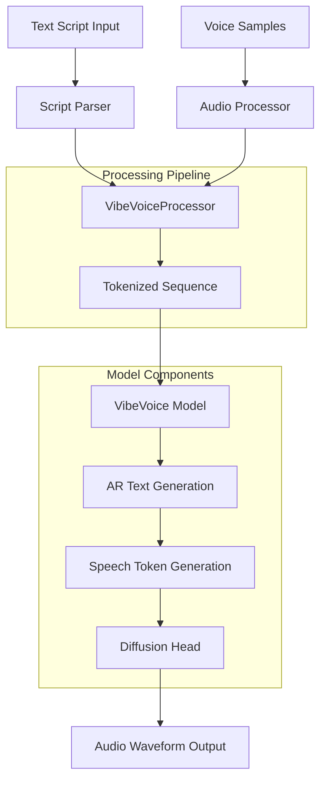

# VibeVoice AI Speech Generation Documentation

## Table of Contents

1. [Project Overview](#project-overview)
2. [System Architecture](#system-architecture)
3. [Installation & Setup](#installation--setup)
4. [Model Details](#model-details)
5. [Code Walkthrough](#code-walkthrough)
6. [Usage Examples](#usage-examples)
7. [API Reference](#api-reference)

## Project Overview

### Purpose

VibeVoice is an advanced AI speech generation system that combines autoregressive (AR) language modeling with diffusion-based audio synthesis. The project addresses the challenge of generating high-quality, multi-speaker speech from text while preserving distinct speaker characteristics through voice cloning capabilities.

### Goals

- **Multi-speaker synthesis**: Generate speech for multiple speakers in a single script
- **Voice cloning**: Preserve individual speaker characteristics using reference audio samples
- **High-quality output**: Produce natural-sounding speech with appropriate prosody and timing
- **Flexible input**: Support various input formats including text scripts, JSON files, and batch processing

### Real-world Applications

- **Podcast generation**: Convert scripts into multi-speaker podcast episodes
- **Audiobook creation**: Generate narrated content with multiple character voices
- **Content localization**: Create multilingual content while preserving speaker identity
- **Accessibility**: Convert text content to speech for visually impaired users

## System Architecture

### High-level Workflow



### Data Flow

1. **Input Processing**:
   - Text scripts are parsed into speaker-text pairs
   - Voice samples are loaded and normalized
   - Data is structured into a unified format

2. **Tokenization**:
   - Text is tokenized using the VibeVoice text tokenizer
   - Audio samples are converted to speech diffusion tokens
   - System prompts and special tokens are added

3. **Model Inference**:
   - Autoregressive generation produces speech tokens
   - Diffusion head converts tokens to audio waveforms
   - Output is decoded and post-processed

4. **Output Generation**:
   - Audio waveforms are generated for each speech segment
   - Multiple speakers are handled sequentially
   - Final audio is assembled and returned

### Input Data Structure

The processor creates a structured input sequence with four main sections:

```text
[System Prompt] + [Voice Input Section] + [Text Input Section] + [Speech Output Section]
```

- **System Prompt**: Instructions for the model
- **Voice Input**: Reference audio as diffusion tokens
- **Text Input**: Speaker scripts to be synthesized  
- **Speech Output**: Generation trigger tokens

## Installation & Setup

### Prerequisites

- Python 3.9 or higher
- CUDA-compatible GPU (recommended)
- 16GB+ RAM for larger models

### Dependencies Installation

```bash
# Clone the repository
git clone https://github.com/zhao-kun/VibeVoice.git
cd VibeVoice

# Install the package in development mode
pip install -e .
```

### Key Dependencies

The project relies on several core libraries:

```toml
dependencies = [
    "torch",                    # PyTorch framework
    "transformers==4.51.3",     # HuggingFace transformers
    "diffusers",               # Diffusion models
    "accelerate==1.6.0",       # Distributed training
    "librosa",                 # Audio processing
    "scipy",                   # Scientific computing
    "numpy",                   # Numerical operations
    "gradio",                  # Demo interface
    "tqdm",                    # Progress bars
    "ml-collections",          # Configuration management
    "absl-py",                 # Command line flags
    "av",                      # Audio/video processing
    "aiortc"                   # Real-time communication
]
```

### Environment Setup

1. **GPU Configuration**:

   ```bash
   # Verify CUDA availability
   python -c "import torch; print(torch.cuda.is_available())"
   ```

2. **Model Download**:

   ```bash
   # Download pre-trained models (adjust path as needed)
   # Models should be placed in appropriate directories
   ```

3. **Voice Samples**:

   ```bash
   # Place reference voice files in demo/voices/
   mkdir -p demo/voices
   # Copy .wav files to this directory
   ```

## Model Details

### Architecture Overview

VibeVoice employs a hybrid architecture combining:

1. **Qwen Language Model**: Serves as the backbone for text understanding and autoregressive generation
2. **Diffusion Head**: Converts discrete speech tokens to continuous audio waveforms
3. **Tokenizers**: Handle text and audio tokenization

### Model Components

#### Core Model (`VibeVoiceModel`)
- **Framework**: PyTorch with Transformers integration
- **Base Architecture**: Qwen2.5 (1.5B or 7B parameters)
- **Input Processing**: Unified text and audio token sequences
- **Output**: Speech tokens and audio waveforms

#### Inference Model (`VibeVoiceForConditionalInference`)
- **Purpose**: Optimized for inference and generation
- **Features**: Streaming support, constraint processing, batch generation
- **Methods**: `generate()`, `streaming_generate()`

### Input/Output Specifications

#### Input Format
- **Text**: String, file path (.txt/.json), or list of scripts
- **Voice Samples**: List of audio file paths or numpy arrays
- **Shape**: Variable length sequences, batched and padded

#### Output Format
- **Speech Outputs**: List of torch.FloatTensor waveforms
- **Sequences**: Generated token sequences
- **Metadata**: Speaker information and processing details

### Preprocessing & Postprocessing

#### Audio Preprocessing

```python
# Audio normalization pipeline
if db_normalize:
    audio = audio_normalizer(audio)  # dB normalization
audio_tokens = tokenizer.encode(audio)  # Convert to tokens
```

#### Text Preprocessing

```python
# Script parsing
parsed_script = parse_script(text)  # Extract speaker-text pairs
tokens = tokenizer.encode(text)     # Tokenize text
```

#### Postprocessing

```python
# Audio generation
speech_outputs = diffusion_head.decode(speech_tokens)
waveforms = [tensor.cpu().numpy() for tensor in speech_outputs]
```

## Code Walkthrough

### Main Components

#### 1. Model Loading Functions

**Location**: `vibevoice/modular/modeling_vibevoice_inference.py`

```python
class VibeVoiceForConditionalInference(PreTrainedModel):
    def __init__(self, config: VibeVoiceConfig):
        super().__init__(config)
        self.model = VibeVoiceModel(config)
        # Initialize components
```

Key loading methods:

- `from_pretrained()`: Load pre-trained model weights
- `load_state_dict()`: Load custom checkpoint

#### 2. Data Preprocessing Scripts

**Location**: `vibevoice/processor/vibevoice_processor.py`

```python
class VibeVoiceProcessor:
    def __call__(self, text, voice_samples, **kwargs):
        # Main processing pipeline
        return self._batch_encode(processed_inputs)
```

Key preprocessing functions:

- `_parse_script()`: Parse text into speaker segments
- `_create_voice_prompt()`: Process voice samples
- `_convert_json_to_script()`: Handle JSON input files

#### 3. Inference Functions

**Location**: `vibevoice/modular/modeling_vibevoice_inference.py`

```python
def generate(self, inputs, generation_config=None, **kwargs):
    """Main generation method"""
    # Autoregressive generation with speech token handling
```

Key inference methods:

- `generate()`: Standard generation
- `streaming_generate()`: Real-time streaming
- `_generate_speech_tokens()`: Speech-specific generation

#### 4. Utility Modules

**Location**: Various utility files

- `util/safetensors_util.py`: Model serialization utilities
- `vibevoice/schedule/`: Diffusion scheduling algorithms
- `config/configuration_vibevoice.py`: Configuration management

#### 5. Main Entry Point

**Location**: `demo/local_file_inference.py`

```python
class VoiceMapper:
    """Maps speaker names to voice file paths"""
    
def main():
    # Command-line interface for inference
    parser = argparse.ArgumentParser()
    # Setup arguments and run inference
```

### Key Classes

#### VibeVoiceProcessor

- **Purpose**: Unified input processing
- **Input**: Text scripts and voice samples
- **Output**: Model-ready BatchEncoding objects
- **Features**: Batch processing, file input support, padding/truncation

#### VibeVoiceForConditionalInference

- **Purpose**: Main inference engine
- **Input**: Processed BatchEncoding
- **Output**: Generated speech waveforms
- **Features**: Constraint processing, streaming, caching

#### VoiceMapper

- **Purpose**: Speaker-to-voice file mapping
- **Input**: Speaker names from scripts
- **Output**: Corresponding voice file paths
- **Features**: Fuzzy matching, preset management

### Processing Pipeline

1. **Script Parsing**:

   ```python
   # Parse "Speaker 0: Hello world" format
   speakers, texts = parse_speaker_script(input_text)
   ```

2. **Voice Processing**:

   ```python
   # Load and process voice samples
   voice_embeddings = process_voice_samples(voice_files)
   ```

3. **Sequence Building**:

   ```python
   # Create structured input sequence
   input_ids = build_sequence(system_prompt, voice_section, 
                             text_section, output_trigger)
   ```

4. **Generation**:

   ```python
   # Generate speech tokens and decode to audio
   outputs = model.generate(input_ids, voice_embeddings)
   ```

### Special Token Handling

The model uses special tokens for speech processing:

- `<speech_start>`: Marks beginning of speech generation
- `<speech_end>`: Marks end of speech segment
- `<speech_diffusion>`: Represents audio content as tokens

These tokens are processed differently during generation to maintain speech quality and timing.

## Usage Examples

### Basic Text-to-Speech

```python
from vibevoice.processor.vibevoice_processor import VibeVoiceProcessor
from vibevoice.modular.modeling_vibevoice_inference import VibeVoiceForConditionalInference

# Load model and processor
processor = VibeVoiceProcessor.from_pretrained("path/to/model")
model = VibeVoiceForConditionalInference.from_pretrained("path/to/model")

# Simple text input
text = "Speaker 0: Hello, welcome to our podcast!"
voice_samples = ["demo/voices/speaker0.wav"]

# Process and generate
inputs = processor(text=text, voice_samples=voice_samples, return_tensors="pt")
outputs = model.generate(**inputs)
speech_audio = outputs.speech_outputs[0]
```

### Multi-speaker Generation

```python
# Multi-speaker script
script = """
Speaker 0: Hello everyone, welcome to today's episode.
Speaker 1: Thanks for having me on the show!
Speaker 0: Let's dive into our main topic.
"""

voice_samples = [
    "demo/voices/host.wav",      # Speaker 0
    "demo/voices/guest.wav"      # Speaker 1  
]

inputs = processor(text=script, voice_samples=voice_samples, return_tensors="pt")
outputs = model.generate(**inputs, max_new_tokens=500)
```

### File-based Input

```python
# Using JSON file input
json_script = "scripts/episode1.json"  # Contains structured speaker data
voice_dir = "voices/"                  # Directory with voice samples

inputs = processor(text=json_script, voice_samples=voice_dir, return_tensors="pt")
outputs = model.generate(**inputs)
```

### Command Line Usage

```bash
# Basic inference
python demo/local_file_inference.py \
    --model_path /path/to/model \
    --text "Speaker 0: Hello world" \
    --voice_dir demo/voices/

# With JSON script
python demo/local_file_inference.py \
    --model_path /path/to/model \
    --text scripts/podcast.json \
    --voice_dir voices/ \
    --output_dir outputs/
```

## API Reference

### VibeVoiceProcessor

#### `__call__(text, voice_samples, **kwargs)`

Primary processing method.

**Parameters**:

- `text`: Input script (str, file path, or list)
- `voice_samples`: Voice reference files (list of paths/arrays)
- `padding`: Sequence padding strategy (bool/str)
- `truncation`: Truncation strategy (bool/str)
- `max_length`: Maximum sequence length (int)
- `return_tensors`: Output format ("pt" for PyTorch)

**Returns**: `BatchEncoding` with processed inputs

### VibeVoiceForConditionalInference

#### `generate(inputs, generation_config=None, **kwargs)`

Main generation method.

**Parameters**:

- `inputs`: Processed BatchEncoding from processor
- `generation_config`: Generation configuration object
- `max_new_tokens`: Maximum tokens to generate
- `do_sample`: Whether to use sampling
- `temperature`: Sampling temperature

**Returns**: `VibeVoiceGenerationOutput` with speech waveforms

### Configuration

Models can be configured using JSON files or `VibeVoiceConfig` objects:

```python
from config.configuration_vibevoice import VibeVoiceConfig

config = VibeVoiceConfig(
    vocab_size=32000,
    hidden_size=1536,
    intermediate_size=8960,
    # ... other parameters
)
```

This comprehensive documentation provides a complete understanding of the VibeVoice system, from high-level concepts to implementation details.
