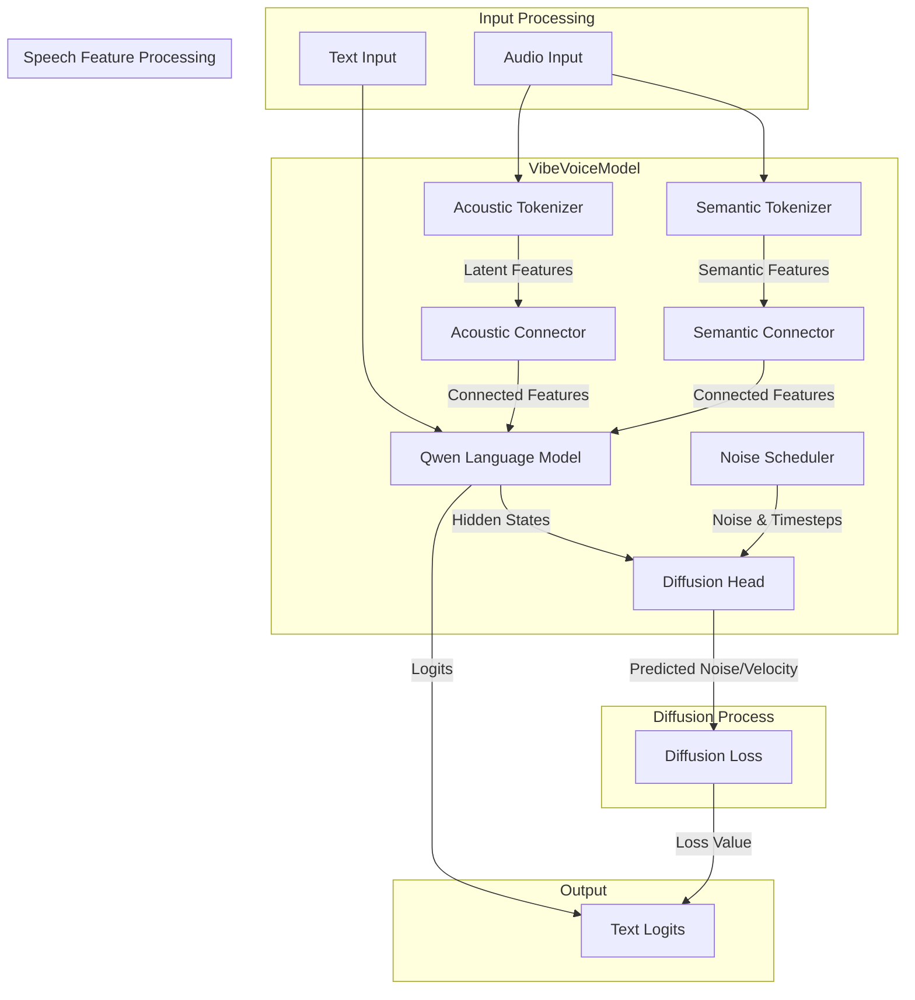
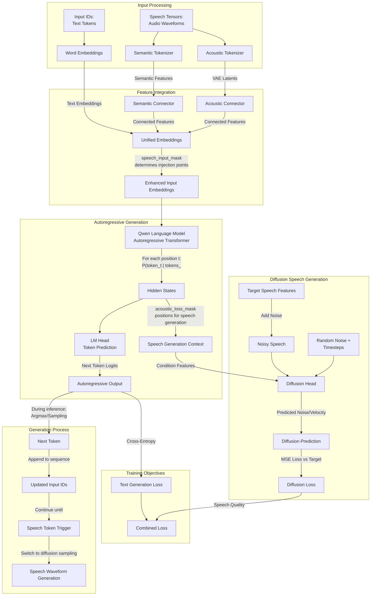

# VibeVoice Model Components Analysis

## Overview

This document provides a detailed analysis of the VibeVoice model components, excluding the Qwen language model backbone. The analysis covers the architecture, function signatures, input/output specifications, and forward pass logic for each major component.

## Model Composition Architecture



## Component 1: SpeechConnector

### Purpose
Connects speech tokenizer outputs to the language model's hidden dimension space.

### Architecture
```python
class SpeechConnector(nn.Module):
    def __init__(self, input_dim, output_dim):
        self.fc1 = nn.Linear(input_dim, output_dim)
        self.norm = LlamaRMSNorm(output_dim, eps=1e-6)
        self.fc2 = nn.Linear(output_dim, output_dim)
```

### Function Analysis

#### `__init__(input_dim, output_dim)`
- **Input Parameters**:
  - `input_dim` (int): Dimension of speech tokenizer output
  - `output_dim` (int): Dimension of language model hidden states
- **Components**:
  - Two linear layers with RMSNorm normalization
  - Residual-like structure for feature transformation

#### `forward(features, **kwargs)`
- **Input Parameters**:
  - `features` (torch.Tensor): Speech features from tokenizers
  - Shape: `[batch_size, sequence_length, input_dim]`
- **Output**:
  - `torch.Tensor`: Transformed features compatible with language model
  - Shape: `[batch_size, sequence_length, output_dim]`
- **Logic**:
  1. Apply first linear transformation
  2. Apply RMSNorm normalization
  3. Apply second linear transformation

## Component 2: VibeVoiceAcousticTokenizerModel

### Purpose
Encodes audio waveforms into latent acoustic representations and decodes them back to audio.

### Architecture Components

#### TokenizerEncoder
- **Purpose**: Converts raw audio to latent representations
- **Input**: Audio waveforms `[batch_size, channels, time_steps]`
- **Output**: Latent features `[batch_size, vae_dim, compressed_time]`

#### TokenizerDecoder  
- **Purpose**: Reconstructs audio from latent representations
- **Input**: Latent features `[batch_size, vae_dim, compressed_time]`
- **Output**: Reconstructed audio `[batch_size, channels, time_steps]`

### Key Functions

#### `__init__(config)`
- **Input Parameters**:
  - `config`: Configuration object with model parameters
- **Key Config Parameters**:
  - `vae_dim`: Latent space dimension
  - `encoder_ratios`: Downsampling ratios for encoder
  - `decoder_ratios`: Upsampling ratios for decoder
  - `encoder_depths`/`decoder_depths`: Number of transformer blocks per stage
  - `fix_std`: Fixed standard deviation for Gaussian sampling

#### `encode(audio, cache=None, sample_indices=None, use_cache=False, debug=False)`
- **Input Parameters**:
  - `audio` (torch.Tensor): Raw audio waveforms
    - Shape: `[batch_size, channels, time_steps]`
  - `cache`: Optional streaming cache for real-time processing
  - `sample_indices`: Sample identifiers for cache management
  - `use_cache` (bool): Enable streaming mode
- **Output**:
  - `VibeVoiceTokenizerEncoderOutput`: Contains mean and std parameters
    - `mean`: `[batch_size, compressed_time, vae_dim]`
    - `std`: Fixed standard deviation value
- **Logic**:
  1. Pass audio through encoder network
  2. Permute dimensions to match expected format
  3. Return Gaussian distribution parameters

#### `decode(latents, cache=None, sample_indices=None, use_cache=False, debug=False)`
- **Input Parameters**:
  - `latents` (torch.Tensor): Latent representations
    - Shape: `[batch_size, compressed_time, vae_dim]` or `[batch_size, vae_dim, compressed_time]`
  - Cache parameters (same as encode)
- **Output**:
  - `torch.Tensor`: Reconstructed audio
    - Shape: `[batch_size, channels, time_steps]`
- **Logic**:
  1. Ensure correct dimension order
  2. Pass through decoder network
  3. Return reconstructed audio

#### `sampling(encoder_output, dist_type=None)`
- **Input Parameters**:
  - `encoder_output`: VibeVoiceTokenizerEncoderOutput object
  - `dist_type`: Sampling strategy ('fix' or 'gaussian')
- **Output**:
  - `sampled_latents` (torch.Tensor): Sampled from distribution
  - `std_used` (torch.Tensor): Standard deviation used for sampling
- **Logic**:
  - `'fix'`: Use fixed standard deviation
  - `'gaussian'`: Use variable standard deviation per batch

### VibeVoiceTokenizerEncoderOutput

#### `sample(dist_type='fix')`
- **Input Parameters**:
  - `dist_type` (str): Sampling method
- **Sampling Methods**:
  - `'fix'`: `x = mean + fix_std * randn_like(mean)`
  - `'gaussian'`: `x = mean + variable_std * randn_like(mean)`
  - `'none'`: Return mean directly

## Component 3: VibeVoiceSemanticTokenizerModel

### Purpose
Extracts semantic information from audio for conditioning (encoder-only model).

### Architecture
- Similar to acoustic tokenizer but only includes encoder
- No decoder component as semantic tokens don't need reconstruction

### Key Functions

#### `encode(audio, cache=None, sample_indices=None, use_cache=False, debug=False)`
- **Input**: Same as acoustic tokenizer
- **Output**: Semantic latent representations
- **Difference**: No fixed standard deviation, returns only mean

#### `sampling(encoder_output, dist_type=None)`
- **Logic**: Always returns mean without sampling (dist_type='none')

## Component 4: VibeVoiceDiffusionHead

### Purpose
Predicts noise or velocity for diffusion-based speech generation.

### Architecture Components

#### TimestepEmbedder
- **Purpose**: Converts scalar timesteps to vector embeddings
- **Input**: Timestep values `[batch_size]`
- **Output**: Timestep embeddings `[batch_size, hidden_size]`
- **Method**: Sinusoidal position encoding + MLP

#### HeadLayer
- **Purpose**: Transformer-like layer with adaptive layer normalization
- **Components**:
  - FeedForwardNetwork (SwiGLU activation)
  - RMSNorm normalization
  - AdaLN modulation for conditioning

#### FinalLayer
- **Purpose**: Final output projection with conditioning
- **Output**: Predicted noise or velocity

### Key Functions

#### `__init__(config)`
- **Input Parameters**:
  - `config`: Configuration object
- **Key Config Parameters**:
  - `hidden_size`: Hidden dimension
  - `latent_size`: Input latent dimension
  - `head_layers`: Number of transformer layers
  - `head_ffn_ratio`: FFN expansion ratio
  - `rms_norm_eps`: Normalization epsilon

#### `forward(noisy_images, timesteps, condition)`
- **Input Parameters**:
  - `noisy_images` (torch.Tensor): Noisy latent features
    - Shape: `[batch_size, sequence_length, latent_size]`
  - `timesteps` (torch.Tensor): Diffusion timesteps
    - Shape: `[batch_size]`
  - `condition` (torch.Tensor): Conditioning information from language model
    - Shape: `[batch_size, sequence_length, hidden_size]`
- **Output**:
  - `torch.Tensor`: Predicted noise or velocity
    - Shape: `[batch_size, sequence_length, latent_size]`
- **Logic**:
  1. Project noisy images to hidden dimension
  2. Embed timesteps using sinusoidal encoding
  3. Project condition to conditioning dimension
  4. Combine timestep and condition embeddings
  5. Pass through transformer layers with AdaLN modulation
  6. Apply final layer with conditioning

### AdaLN Modulation
```python
def modulate(x, shift, scale):
    return x * (1 + scale) + shift
```
- Adaptive normalization that modulates features based on conditioning

## Component 5: VibeVoiceForConditionalGeneration

### Purpose
Main model class that orchestrates all components for training and inference.

### Forward Pass Logic

#### `forward(input_ids, attention_mask, speech_tensors, speech_masks, ...)`

**Input Parameters**:
- `input_ids` (torch.LongTensor): Tokenized text sequences
- `attention_mask` (torch.Tensor): Attention mask for text
- `speech_tensors` (torch.FloatTensor): Raw audio waveforms
- `speech_masks` (torch.BoolTensor): Masks for valid audio regions
- `speech_semantic_tensors` (torch.FloatTensor): Semantic speech features
- `acoustic_input_mask` (torch.BoolTensor): Positions for acoustic features in input
- `acoustic_loss_mask` (torch.BoolTensor): Positions for diffusion loss calculation
- `speeches_loss_input` (torch.FloatTensor): Mask for audio requiring diffusion
- `ddpm_batch_mul` (int): Batch multiplication factor for diffusion

**Forward Pass Flow**:



**Detailed Steps**:

1. **Embedding Processing**:
   ```python
   x = self.get_input_embeddings()(input_ids)  # [batch, seq_len, hidden_size]
   ```

2. **Speech Feature Processing**:
   ```python
   # Process semantic features
   semantic_features = self.model.semantic_connector(speech_semantic_tensors)
   
   # Process acoustic features  
   speech_features, speech_connect_features = self.forward_speech_features(
       speech_tensors, speech_masks, speech_type
   )
   ```

3. **Feature Integration** (Multimodal Input Preparation):
   ```python
   # Inject speech features into specific positions in text sequence
   # acoustic_input_mask indicates where <speech_diffusion> tokens are located
   x[acoustic_input_mask] = speech_connect_features + semantic_features
   
   # Result: Unified sequence with text + speech embeddings
   # Format: [system_prompt] [voice_input] [text_input] [speech_output_trigger]
   ```

4. **Autoregressive Language Model Forward**:
   ```python
   # The key autoregressive property: each position only attends to previous positions
   outputs = self.model(
       inputs_embeds=x,           # Multimodal input embeddings
       attention_mask=attention_mask,  # Causal mask ensures P(t|<t)
       use_cache=use_cache,       # KV-cache for efficient generation
       past_key_values=past_key_values  # Previous states for generation
   )
   
   hidden_states = outputs.last_hidden_state  # [batch, seq_len, hidden_size]
   logits = self.lm_head(hidden_states)        # [batch, seq_len, vocab_size]
   
   # During generation: logits[:, -1, :] predicts next token
   # P(token_t | token_0, ..., token_{t-1}, speech_context)
   ```

5. **Diffusion Loss Calculation**:
   ```python
   if speech_tensors is not None and acoustic_loss_mask.sum() > 0:
       # Sample random noise and timesteps
       noise = torch.randn((speech_len * ddmp_batch_mul, latent_size))
       timesteps = torch.multinomial(torch.ones(num_steps), speech_len * ddmp_batch_mul)
       
       # Add noise to speech features
       noisy_speech = scheduler.add_noise(speech_features, noise, timesteps)
       
       # Predict noise/velocity
       model_output = self.model.prediction_head(
           noisy_speech, timesteps, condition_features
       )
       
       # Calculate loss
       if prediction_type == "epsilon":
           target = noise
       elif prediction_type == "v_prediction":
           target = scheduler.get_velocity(speech_features, noise, timesteps)
       
       diffusion_loss = F.mse_loss(model_output, target)
   ```

**Output**:
- `VibeVoiceCausalLMOutputWithPast`:
  - `loss`: Language modeling loss (if labels provided)
  - `diffusion_loss`: Diffusion loss for speech generation
  - `speech_token_num`: Number of speech tokens processed
  - `logits`: Text generation logits
  - `past_key_values`: Cached key-value pairs for generation

### Autoregressive Generation Process

The VibeVoice model follows a **two-stage autoregressive process**:

#### Stage 1: Text Token Generation (Autoregressive)
```python
# Input sequence structure:
# [system_prompt] [voice_samples] [text_input] [<speech_start>]

# During generation:
for position in range(current_length, max_length):
    logits = model(input_ids[:, :position+1])  # Only see previous tokens
    next_token = sample(logits[:, -1, :])      # Predict next token
    input_ids = torch.cat([input_ids, next_token], dim=1)
    
    if next_token == speech_start_token:
        break  # Switch to diffusion generation
```

#### Stage 2: Speech Generation (Diffusion)
```python
# When <speech_start> is generated, switch to diffusion sampling
if next_token == speech_start_token:
    # Use hidden states as conditioning for diffusion
    condition = hidden_states[acoustic_loss_mask]  # Speech positions
    
    # Iterative denoising process
    audio_latents = torch.randn(latent_shape)
    for t in reversed(range(num_diffusion_steps)):
        noise_pred = diffusion_head(audio_latents, t, condition)
        audio_latents = scheduler.step(noise_pred, t, audio_latents)
    
    # Decode latents to audio waveform
    audio = acoustic_tokenizer.decode(audio_latents)
```

#### Key Autoregressive Properties:

1. **Causal Attention**: Each position only attends to previous positions
   ```python
   # Attention mask ensures autoregressive property
   mask[i, j] = 0 if j > i else 1  # Upper triangular mask
   ```

2. **Sequential Dependency**: 
   ```python
   P(sequence) = ∏ P(token_t | token_0, ..., token_{t-1}, speech_context)
   ```

3. **Cache Mechanism**: KV-cache enables efficient generation
   ```python
   # Only compute new key-value pairs for the latest token
   past_key_values = outputs.past_key_values  # Cache previous computations
   ```

4. **Mixed Generation**: Combines discrete text tokens with continuous speech latents
   - Text tokens: Categorical distribution sampling
   - Speech tokens: Gaussian diffusion process

### Speech Feature Processing Details

#### `forward_speech_features(speech_tensors, speech_masks, speech_type, return_unmask)`

**Input Parameters**:
- `speech_tensors`: Raw audio or VAE features
- `speech_masks`: Validity masks for speech
- `speech_type`: Processing type ("audio" or "vae")
- `return_unmask`: Whether to return full or masked features

**Processing Logic**:

1. **Audio Processing**:
   ```python
   if speech_type == "audio":
       frames = self.model.acoustic_tokenizer.encode(speech_tensors)[0][0]
       audio_tokens = frames.sample(self.model.acoustic_tokenizer.std_dist_type)[0]
   ```

2. **VAE Processing**:
   ```python
   elif speech_type == "vae":
       speech_mode = speech_tensors.reshape(batch_size, -1, vae_dim)
       # Add Gaussian noise for sampling
       audio_tokens = speech_mode + std * torch.randn(speech_mode.shape)
   ```

3. **Normalization**:
   ```python
   # Calculate or use cached scaling factors
   if torch.isnan(self.model.speech_scaling_factor):
       scaling_factor = 1. / audio_tokens[speech_masks].std()
       bias_factor = -audio_tokens[speech_masks].mean()
   
   audio_features = (audio_tokens + bias_factor) * scaling_factor
   ```

4. **Connection**:
   ```python
   connect_features = self.model.acoustic_connector(audio_features)
   ```

**Output**:
- `audio_features`: Normalized latent features
- `connect_features`: Features projected to language model dimension

## Streaming Support

### VibeVoiceTokenizerStreamingCache

**Purpose**: Manages state for streaming inference with convolutional layers.

**Key Methods**:
- `get(layer_id, sample_indices)`: Retrieve cached states
- `set(layer_id, sample_indices, states)`: Store new states
- `clear()`: Clear cache for memory management

**Usage in SConv1d/SConvTranspose1d**:
```python
def forward(x, cache=None, sample_indices=None, use_cache=False):
    if use_cache and cache is not None:
        # Streaming mode
        cached_states = cache.get(self.layer_id, sample_indices)
        input_with_context = torch.cat([cached_states, x], dim=2)
        output = self.conv(input_with_context)
        # Update cache for next chunk
        cache.set(self.layer_id, sample_indices, new_cache)
    else:
        # Non-streaming mode
        output = self._forward_non_streaming(x)
```

## Configuration Parameters

### Key Model Configuration
```python
class VibeVoiceConfig:
    # Language model config
    decoder_config: QwenConfig
    
    # Acoustic tokenizer config
    acoustic_tokenizer_config:
        vae_dim: int = 256
        encoder_ratios: List[int] = [8, 5, 4, 2]
        decoder_ratios: List[int] = [2, 4, 5, 8]
        encoder_depths: List[int] = [2, 2, 6, 2]
        decoder_depths: List[int] = [2, 6, 2, 2]
    
    # Semantic tokenizer config  
    semantic_tokenizer_config:
        vae_dim: int = 256
        
    # Diffusion head config
    diffusion_head_config:
        hidden_size: int = 2048
        head_layers: int = 8
        head_ffn_ratio: float = 4.0
        latent_size: int = 256
        ddmp_num_steps: int = 1000
        prediction_type: str = "epsilon"  # or "v_prediction"
```

This architecture enables VibeVoice to perform high-quality text-to-speech synthesis by combining autoregressive text generation with diffusion-based audio synthesis, while supporting both batch and streaming inference modes.