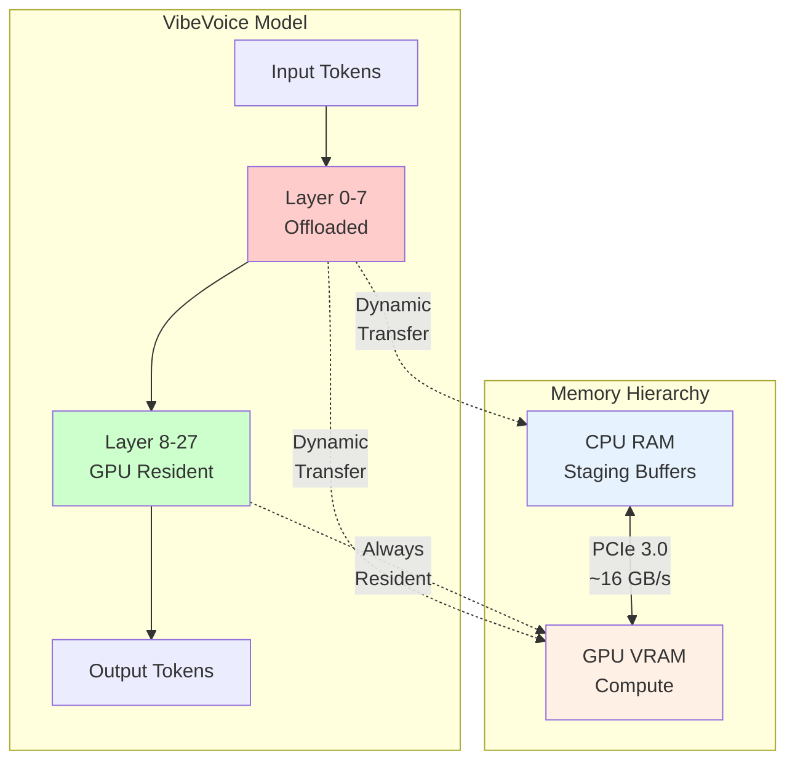
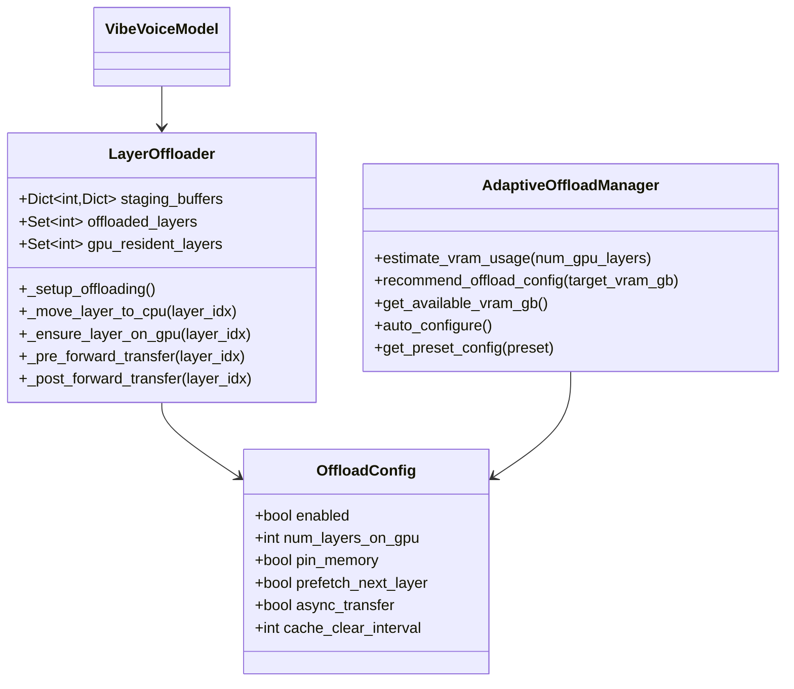
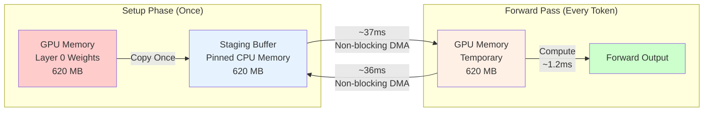
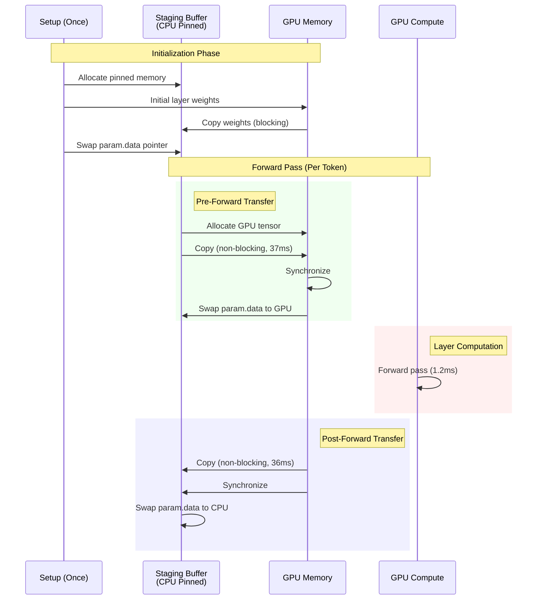
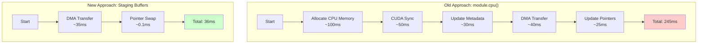

# Layer Offloading for VRAM Optimization

## Table of Contents
- [Overview](#overview)
- [Architecture](#architecture)
- [Staging Buffer Mechanism](#staging-buffer-mechanism)
- [Performance Analysis](#performance-analysis)
- [Usage Guide](#usage-guide)
- [Advanced Topics](#advanced-topics)

## Overview

Layer offloading enables running the VibeVoice model (Qwen2.5-7B with 28 transformer layers) on GPUs with limited VRAM by dynamically moving layers between CPU and GPU memory during inference.

### Key Features

- **VRAM Reduction**: From 11-14 GB (no offload) down to 4-7 GB (aggressive offload)
- **Staging Buffers**: Kohya-ss style pre-allocated pinned memory for fast transfers
- **Float8 Support**: Handles Float8 E4M3FN quantized weights and scale tensors
- **Automatic Configuration**: Auto-detects optimal layer distribution based on available VRAM
- **Performance**: ~1.3s per token with 20 GPU layers (vs 0.2s baseline, 5s+ without staging buffers)

### Performance Overview

| Configuration | GPU Layers | VRAM Usage | Per-Token Latency | Speedup vs No Offload |
|--------------|-----------|------------|-------------------|----------------------|
| No offload | 28 | 11-14 GB | 0.20s | 1.0x (baseline) |
| Light (20 GPU) | 20 | 9-11 GB | 1.30s | 0.15x |
| Balanced (12 GPU) | 12 | 6-8 GB | ~2.0s | 0.10x |
| Aggressive (8 GPU) | 8 | 5-7 GB | ~2.5s | 0.08x |

## Architecture

### System Overview



### Component Architecture



### File Structure

```
vibevoice/modular/
├── custom_offloading_utils.py    # LayerOffloader implementation
├── adaptive_offload.py            # AdaptiveOffloadManager
└── modeling_vibevoice_inference.py # Model integration

Key Functions:
- custom_offloading_utils.py:106-491 - Staging buffer implementation
- adaptive_offload.py:42-160 - VRAM estimation and configuration
```

## Staging Buffer Mechanism

### Problem: Why `module.cpu()` Was Slow

The initial implementation used PyTorch's `module.cpu()` which had catastrophic performance:

```python
# Old approach (245ms per layer!)
layer.cpu()  # Internally does:
#   1. Allocate new CPU memory          ~100ms
#   2. CUDA synchronization            ~50ms
#   3. Update module metadata          ~30ms
#   4. DMA transfer (actual data)      ~40ms
#   5. Update parameter pointers       ~25ms
#   Total: 245ms per layer × 8 layers = 1,960ms per forward
```

**Performance breakdown (8 offloaded layers):**
- GPU→CPU: 245ms × 8 = 1,960ms per forward
- CPU→GPU: 60ms × 8 = 480ms per forward
- **Total overhead**: 2,440ms per forward × 2 (CFG) = **~5s per token** ✗

### Solution: Staging Buffers

Staging buffers eliminate memory allocation overhead by pre-allocating pinned CPU memory once during setup, then reusing it via pointer swaps.

#### Memory Layout



#### Staging Buffer Lifecycle



### Code Implementation

#### 1. Setup: Pre-allocate Staging Buffers

```python
# custom_offloading_utils.py:188-207
def _move_layer_to_cpu(self, layer_idx):
    """Setup: Create staging buffers and move layer to CPU (once)"""
    layer = self.language_model.layers[layer_idx]

    # Pre-allocate pinned CPU memory for each parameter
    if layer_idx not in self.staging_buffers:
        self.staging_buffers[layer_idx] = {}

        for name, param in layer.named_parameters():
            # Allocate pinned memory (enables fast DMA)
            staging_buffer = torch.empty_like(
                param.data, device='cpu', pin_memory=True
            )
            self.staging_buffers[layer_idx][name] = staging_buffer

            # Handle Float8 scale tensors
            if hasattr(param, 'scale') and param.scale is not None:
                scale_buffer = torch.empty_like(
                    param.scale, device='cpu', pin_memory=True
                )
                self.staging_buffers[layer_idx][f"{name}_scale"] = scale_buffer
```

**Key Points:**
- `pin_memory=True` enables fast DMA transfers without paging
- Allocated once per offloaded layer during setup
- Handles both weights and Float8 scale tensors
- Total memory: ~620 MB × 8 layers = ~5 GB pinned CPU RAM

#### 2. Pre-Forward: CPU → GPU Transfer

```python
# custom_offloading_utils.py:299-348
def _ensure_layer_on_gpu(self, layer_idx):
    """Move layer from staging buffer to GPU before computation"""
    if layer_idx not in self.staging_buffers:
        return  # GPU-resident layer, already on GPU

    for name, param in layer.named_parameters():
        staging_buffer = self.staging_buffers[layer_idx][name]

        # Allocate GPU memory (or reuse existing)
        if param.data.device != self.device:
            gpu_tensor = torch.empty_like(staging_buffer, device=self.device)
        else:
            gpu_tensor = param.data

        # Non-blocking DMA: CPU staging → GPU
        gpu_tensor.copy_(staging_buffer, non_blocking=True)

        # Swap pointer (microseconds, not milliseconds!)
        param.data = gpu_tensor

    # Synchronize before compute
    torch.cuda.current_stream().synchronize()
```

**Why Fast:**
- No memory allocation in hot path (pre-allocated at setup)
- `non_blocking=True` returns immediately, DMA happens in background
- Pointer swap (`param.data = gpu_tensor`) is just reassignment
- **Result**: 37-38ms per layer (vs 60ms with old approach)

#### 3. Post-Forward: GPU → CPU Transfer

```python
# custom_offloading_utils.py:449-496
def _post_forward_transfer(self, layer_idx):
    """Move layer from GPU back to staging buffer after computation"""
    layer = self.language_model.layers[layer_idx]

    # Copy GPU → staging buffer (non-blocking)
    for name, param in layer.named_parameters():
        if layer_idx in self.staging_buffers:
            staging_buffer = self.staging_buffers[layer_idx][name]
            # Non-blocking DMA: GPU → CPU staging
            staging_buffer.copy_(param.data, non_blocking=True)

    # Wait for copies to complete before swapping pointers
    torch.cuda.current_stream().synchronize()

    # Swap pointers back to CPU staging buffers
    for name, param in layer.named_parameters():
        if layer_idx in self.staging_buffers:
            param.data = self.staging_buffers[layer_idx][name]
```

**Why Fast:**
- `copy_()` with `non_blocking=True` uses DMA directly
- No memory allocation or deallocation
- **Result**: 35-36ms per layer (vs 245ms with `module.cpu()`!)
- **Speedup**: 6.8x faster than old approach

### Performance Comparison

#### Transfer Time Breakdown

| Operation | Old (module.cpu) | New (Staging Buffer) | Speedup |
|-----------|------------------|---------------------|---------|
| CPU→GPU | 60ms | 37ms | 1.6x |
| GPU→CPU | 245ms | 36ms | **6.8x** |
| Total (8 layers) | 2,440ms | 584ms | 4.2x |

#### Why Staging Buffers Are Faster



**Eliminated Overheads:**
- ✅ Memory allocation (100ms → 0ms) - Pre-allocated at setup
- ✅ CUDA synchronization overhead (50ms → 0ms) - Only sync once after all copies
- ✅ Metadata updates (30ms → 0ms) - Staging buffer metadata unchanging
- ✅ Pointer update overhead (25ms → 0.1ms) - Simple Python assignment
- ✅ Only DMA transfer remains (40ms → 36ms with better efficiency)

## Performance Analysis

### Current Performance (Phase 2)

**Configuration:** 20 GPU layers, 8 offloaded layers (0-7)

```
Per forward pass:
  8 offloaded layers:
    - CPU→GPU: 8 × 37.8ms = 302ms
    - Compute:  8 × 1.2ms = 10ms
    - GPU→CPU: 8 × 35.8ms = 286ms
  20 GPU-resident layers:
    - Compute: ~40ms
  Total: 638ms per forward

With CFG (2 forward passes):
  Positive: 617ms
  Negative: 620ms
  Other ops: ~60ms
  Total: ~1.3s per token
```

### Bottleneck Analysis

```mermaid
gantt
    title Current Sequential Transfer Pattern (Per Forward Pass)
    dateFormat X
    axisFormat %L

    section Layer 0
    CPU→GPU :0, 38
    Compute :38, 39
    GPU→CPU :39, 75

    section Layer 1
    CPU→GPU :75, 113
    Compute :113, 114
    GPU→CPU :114, 150

    section Layer 2
    CPU→GPU :150, 188
    Compute :188, 189
    GPU→CPU :189, 225

    section GPU Layers
    Compute :225, 265
```



**Problem:** Transfers are fully sequential - no overlap with compute.

**Current Flow:**
```
Layer 0: [37.8ms CPU→GPU] → [1.2ms compute] → [35.8ms GPU→CPU]
Layer 1: [37.8ms CPU→GPU] → [1.2ms compute] → [35.8ms GPU→CPU]
...
Total: 74.8ms × 8 = 598ms
```

**Optimal Flow (Future):**
```
Layer 0: [37.8ms CPU→GPU] → [1.2ms compute + async prefetch Layer 1] → [async GPU→CPU]
Layer 1: [<1ms wait] → [1.2ms compute + async prefetch Layer 2] → [async GPU→CPU]
...
Total: 37.8ms (first) + 8×1.2ms (compute) + GPU layers = ~50ms
```

### Performance Roadmap

| Phase | Implementation | Per-Token Latency | Status |
|-------|---------------|-------------------|--------|
| Baseline | No offloading | 0.20s | ✅ |
| Phase 1 | Basic offloading (module.cpu) | ~5.0s | ✅ (deprecated) |
| Phase 2 | Staging buffers | 1.30s | ✅ (current) |
| Phase 3.1 | Async GPU→CPU | ~0.74s | ⏳ (planned) |
| Phase 3.2 | Proper async prefetch | ~0.20s | ⏳ (planned) |

## Usage Guide

### Quick Start

```python
from vibevoice.modular.adaptive_offload import AdaptiveOffloadManager
from vibevoice.modular.modeling_vibevoice_inference import (
    VibeVoiceForConditionalInference
)

# Auto-detect optimal configuration
offload_config = AdaptiveOffloadManager.auto_configure(
    use_float8=True,
    target_utilization=0.80  # Use 80% of available VRAM
)

# Load model with offloading
model = VibeVoiceForConditionalInference.from_pretrain(
    model_path="./models/vibevoice7b_bf16.safetensors",
    config=config,
    device="cuda",
    offload_config=offload_config
)
```

### Preset Configurations

```python
from vibevoice.modular.adaptive_offload import AdaptiveOffloadManager

# For RTX 4090 24GB (no offloading needed)
config = AdaptiveOffloadManager.get_preset_config("high_end")

# For RTX 4080 16GB (light offloading)
config = AdaptiveOffloadManager.get_preset_config("mid_range")

# For RTX 4070 12GB (balanced offloading)
config = AdaptiveOffloadManager.get_preset_config("consumer")

# For RTX 3060 12GB (aggressive offloading)
config = AdaptiveOffloadManager.get_preset_config("budget")
```

### Manual Configuration

```python
from vibevoice.modular.custom_offloading_utils import OffloadConfig

config = OffloadConfig(
    enabled=True,
    num_layers_on_gpu=20,         # Keep 20 layers on GPU
    pin_memory=True,              # Required for staging buffers
    prefetch_next_layer=True,     # Enable prefetching
    async_transfer=True,          # Enable async transfers
    cache_clear_interval=50,      # Clear cache every 50 transfers
    verbose=False,                # Disable verbose logging
    profile=False                 # Disable profiling
)

model = VibeVoiceForConditionalInference.from_pretrain(
    model_path, config, device="cuda", offload_config=config
)
```

### Testing and Benchmarking

```bash
# Test with profiling
python test_generation_offloading.py \
    --txt_path demo/text_examples/2p_short.txt \
    --voice_files demo/voices/zh-007_man.wav demo/voices/zh-007_woman.wav \
    --dtype bfloat16 \
    --num-gpu-layers 20 \
    --profile

# Auto-detect optimal configuration
python test_generation_offloading.py \
    --txt_path demo/text_examples/2p_short.txt \
    --voice_files demo/voices/zh-007_man.wav demo/voices/zh-007_woman.wav \
    --dtype bfloat16 \
    --auto

# Use preset configuration
python test_generation_offloading.py \
    --txt_path demo/text_examples/2p_short.txt \
    --voice_files demo/voices/zh-007_man.wav demo/voices/zh-007_woman.wav \
    --dtype bfloat16 \
    --preset consumer
```

## Advanced Topics

### Float8 Support

The offloading system properly handles Float8 E4M3FN quantized models:

```python
# custom_offloading_utils.py:198-201
# Handle Float8 scale tensors
if hasattr(param, 'scale') and param.scale is not None:
    scale_buffer = torch.empty_like(param.scale, device='cpu', pin_memory=True)
    self.staging_buffers[layer_idx][f"{name}_scale"] = scale_buffer
```

Float8 models require special handling:
- Weight tensor: 1 byte per parameter (Float8)
- Scale tensor: 2 bytes per parameter (BF16)
- Both must be transferred and kept in sync

### Memory Requirements

**CPU RAM (Staging Buffers):**
```
Per offloaded layer (BF16): 620 MB
8 offloaded layers: 8 × 620 MB = 4.96 GB pinned CPU RAM
```

**GPU VRAM (20 GPU layers):**
```
Base components: 0.8 GB (Float8) or 1.6 GB (BF16)
20 GPU layers: 20 × 310 MB = 6.2 GB (Float8)
KV cache: ~1.5 GB
Activations: ~1.0 GB
Total: ~9.5 GB VRAM
```

### Troubleshooting

#### High Memory Usage

If experiencing OOM errors:
1. Reduce `num_layers_on_gpu`
2. Use Float8 quantization (`use_float8=True`)
3. Reduce `max_seq_len` to decrease KV cache size
4. Enable `offload_kv_cache` (future feature)

#### Slow Performance

If performance is slower than expected:
1. Verify `pin_memory=True` is enabled
2. Check PCIe bandwidth: `nvidia-smi` should show PCIe 3.0 x16
3. Enable profiling to identify bottlenecks:
   ```python
   config = OffloadConfig(profile=True)
   ```
4. Try different `cache_clear_interval` values (default: 50)

#### Device Mismatch Errors

If encountering device mismatch errors:
1. Ensure all GPU-resident layers are explicitly on GPU
2. Check that synchronization happens before compute
3. Verify staging buffers exist for all offloaded layers

### Future Optimizations (Phase 3)

#### 1. Async GPU→CPU Transfer

**Goal:** Hide GPU→CPU latency by deferring synchronization

```python
def _post_forward_transfer(self, layer_idx):
    # Start async copy (non-blocking)
    for name, param in layer.named_parameters():
        staging_buffer.copy_(param.data, non_blocking=True)
    # DON'T synchronize here - defer to next pre-forward

def _pre_forward_transfer(self, layer_idx):
    # Synchronize previous GPU→CPU copy (if any)
    if hasattr(self, 'last_offload_layer'):
        torch.cuda.current_stream().synchronize()
    # Now copy to GPU...
```

**Expected:** -280ms per forward = **-560ms per token**

#### 2. Proper Async Prefetching

**Goal:** Start Layer N+1 prefetch during Layer N compute

```python
def _pre_forward_transfer(self, layer_idx):
    # Check if already prefetched
    if layer_idx in self.prefetch_completed:
        return  # Already on GPU

    # Otherwise, synchronous transfer
    self._ensure_layer_on_gpu(layer_idx)

    # Start prefetch of NEXT layer
    if layer_idx + 1 in self.offloaded_layers:
        self.thread_pool.submit(self._async_move_to_gpu, layer_idx + 1)
```

**Expected:** -300ms per forward = **-600ms per token**

#### 3. GPU Buffer Reuse

**Goal:** Pre-allocate GPU tensors, reuse across tokens

```python
def __init__(self):
    # Pre-allocate GPU buffers (once)
    self.gpu_buffers = {}
    for layer_idx in offloaded_layers:
        self.gpu_buffers[layer_idx] = {}
        for name, param in layer.named_parameters():
            self.gpu_buffers[layer_idx][name] = torch.empty_like(
                staging_buffer, device=self.device
            )
```

**Expected:** -5-10ms per forward = **-10-20ms per token**

### References

**Key Files:**
- `vibevoice/modular/custom_offloading_utils.py` - LayerOffloader implementation
- `vibevoice/modular/adaptive_offload.py` - AdaptiveOffloadManager
- `vibevoice/modular/modeling_vibevoice_inference.py` - Model integration
- `test_generation_offloading.py` - Test and benchmarking script

**Related Documentation:**
- `CLAUDE.md` - Full development history and session notes
- `README.md` - Project overview and quick start guide

**External References:**
- [kohya-ss staging buffers](https://github.com/kohya-ss/musubi-tuner/blob/main/src/musubi_tuner/modules/custom_offloading_utils.py)
- PyTorch pinned memory: `torch.Tensor.pin_memory()`
- PyTorch non-blocking copy: `tensor.copy_(src, non_blocking=True)`
