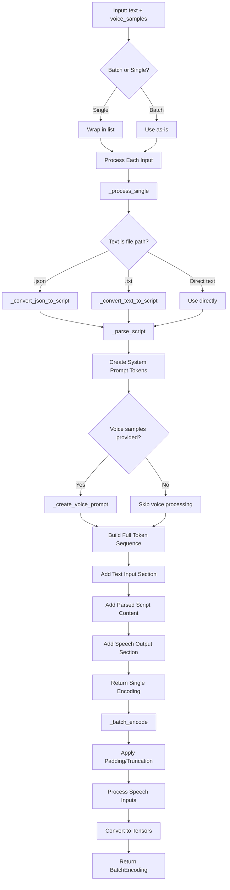
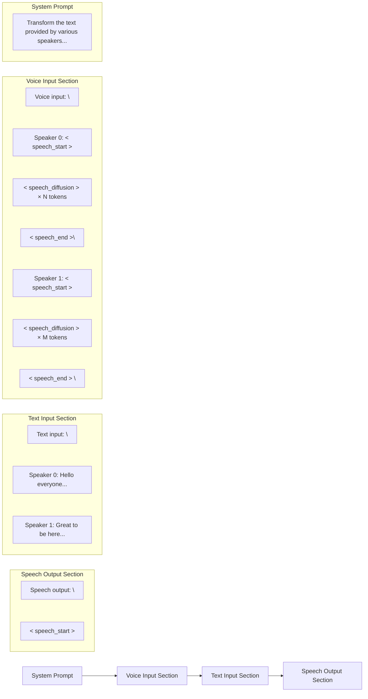

# VibeVoiceProcessor Documentation

## Overview

The `VibeVoiceProcessor` is a unified processor that combines text tokenization and audio processing capabilities for the VibeVoice model. It handles the conversion of podcast scripts and voice samples into the format required by the VibeVoice model for text-to-speech generation.

## Class Initialization

### `__init__` Method

```python
def __init__(self, tokenizer=None, audio_processor=None, speech_tok_compress_ratio=3200, db_normalize=True, **kwargs):
```

#### Parameters:
- **`tokenizer`** (`VibeVoiceTextTokenizer` or `VibeVoiceTextTokenizerFast`, optional): The tokenizer for text processing
- **`audio_processor`** (`VibeVoiceTokenizerProcessor`, optional): The audio processor for speech processing  
- **`speech_tok_compress_ratio`** (`int`, default=3200): The compression ratio for speech tokenization (audio samples per token)
- **`db_normalize`** (`bool`, default=True): Whether to apply decibel normalization to audio inputs

#### Internal Components:
- **`self.audio_normalizer`**: Created if `db_normalize=True`, handles audio level normalization
- **`self.system_prompt`**: Default system instruction for the model

## Main Processing Method

### `__call__` Method

```python
def __call__(
    self,
    text: Optional[Union[str, List[str], TextInput, PreTokenizedInput, List[TextInput], List[PreTokenizedInput]]] = None,
    voice_samples: Optional[Union[List[Union[str, np.ndarray]], List[List[Union[str, np.ndarray]]]]] = None,
    padding: Union[bool, str, PaddingStrategy] = True,
    truncation: Union[bool, str, TruncationStrategy] = False,
    max_length: Optional[int] = None,
    return_tensors: Optional[Union[str, TensorType]] = None,
    return_attention_mask: bool = True,
    **kwargs,
) -> BatchEncoding:
```

#### Input Parameters:

**Text Inputs:**
- **`text`**: Can be:
  - A single script string (e.g., "Speaker 1: Hello world")
  - A list of script strings for batch processing
  - A path to a .json file containing speaker data
  - A path to a .txt file with script content
  - A list of file paths

**Voice Samples:**
- **`voice_samples`**: Optional voice references, can be:
  - A list of audio samples (file paths or numpy arrays) for a single script
  - A list of lists for batch processing (each inner list corresponds to one script)

**Processing Options:**
- **`padding`**: Controls sequence padding behavior
- **`truncation`**: Controls sequence truncation behavior  
- **`max_length`**: Maximum sequence length
- **`return_tensors`**: Output tensor format ("pt" for PyTorch)
- **`return_attention_mask`**: Whether to include attention masks

#### Output: BatchEncoding

The method returns a `BatchEncoding` object containing:

- **`input_ids`**: Tokenized input sequences
- **`attention_mask`**: Attention masks for padded sequences
- **`speech_tensors`**: Processed and padded audio data
- **`speech_masks`**: Masks indicating valid audio frames
- **`speech_input_mask`**: Boolean masks indicating speech token positions in input_ids
- **`parsed_scripts`**: Parsed script data for reference
- **`all_speakers_list`**: List of speaker IDs found in each script

## Processing Flow



## Input IDs Composition

The `input_ids` field contains a carefully structured sequence of tokens representing the complete input to the model:



### Detailed Breakdown:

#### 1. System Prompt (Tokens 0-N)
- Contains the instruction: `" Transform the text provided by various speakers into speech output, utilizing the distinct voice of each respective speaker.\n"`
- Tokenized using the standard tokenizer
- Always present, regardless of input

#### 2. Voice Input Section (Optional, Tokens N+1-M)
- **Header**: `" Voice input:\n"` 
- **For each speaker with voice sample**:
  - Speaker prefix: `" Speaker {id}:"`
  - Speech start token: `<speech_start>`
  - Multiple diffusion tokens: `<speech_diffusion>` × (audio_length ÷ compression_ratio) 
  - Speech end token: `<speech_end>`
  - Newline: `"\n"`

#### 3. Text Input Section (Tokens M+1-P)
- **Header**: `" Text input:\n"`
- **For each speaker line**:
  - Format: `" Speaker {id}:{text}\n"`
  - Contains the actual text content to be converted to speech

#### 4. Speech Output Section (Tokens P+1-End)
- **Header**: `" Speech output:\n"`
- **Generation trigger**: `<speech_start>`
- The model will continue generating from this point

### Special Token Mapping:
- `<speech_start>`: `tokenizer.speech_start_id`
- `<speech_end>`: `tokenizer.speech_end_id` 
- `<speech_diffusion>`: `tokenizer.speech_diffusion_id`

## BatchEncoding Fields Explanation

### Core Fields:

#### `input_ids`
- **Type**: `List[List[int]]` or `torch.LongTensor`
- **Shape**: `[batch_size, sequence_length]`
- **Content**: Complete tokenized sequence as described above
- **Padding**: Left-padded with `tokenizer.pad_id` when `padding=True`

#### `attention_mask`
- **Type**: `List[List[int]]` or `torch.LongTensor`  
- **Shape**: `[batch_size, sequence_length]`
- **Content**: `1` for real tokens, `0` for padding tokens
- **Purpose**: Tells the model which tokens to attend to

#### `speech_input_mask`
- **Type**: `List[List[bool]]` or `torch.BoolTensor`
- **Shape**: `[batch_size, sequence_length]`
- **Content**: `True` for positions where speech embeddings should be inserted
- **Purpose**: Indicates which tokens correspond to `<speech_diffusion>` tokens that need speech embeddings

### Speech Processing Fields:

#### `speech_tensors`
- **Type**: `np.ndarray` or `torch.FloatTensor`
- **Shape**: `[num_speech_samples, max_audio_length]` or `[num_speech_samples, max_audio_length, features]`
- **Content**: Padded and normalized audio waveforms
- **Purpose**: Raw audio data for voice cloning

#### `speech_masks`
- **Type**: `np.ndarray` or `torch.BoolTensor`
- **Shape**: `[num_speech_samples, max_token_length]`
- **Content**: `True` for valid audio tokens, `False` for padding
- **Purpose**: Indicates which parts of the audio are valid (not padding)

### Metadata Fields:

#### `parsed_scripts`
- **Type**: `List[List[Tuple[int, str]]]`
- **Content**: For each script, list of (speaker_id, text) tuples
- **Purpose**: Preserves original parsing for reference

#### `all_speakers_list`
- **Type**: `List[List[int]]`
- **Content**: For each script, list of unique speaker IDs found
- **Purpose**: Tracks which speakers are present in each script

## Usage Examples

### Single Script with Voice Samples:
```python
processor = VibeVoiceProcessor.from_pretrained("path/to/model")

# Process script with voice samples
result = processor(
    text="Speaker 0: Hello everyone! Speaker 1: Great to be here!",
    voice_samples=["speaker0_sample.wav", "speaker1_sample.wav"],
    return_tensors="pt"
)

# Access results
input_ids = result["input_ids"]  # [1, seq_len]
speech_tensors = result["speech_tensors"]  # [2, audio_len]
speech_input_mask = result["speech_input_mask"]  # [1, seq_len]
```

### Batch Processing:
```python
# Process multiple scripts
result = processor(
    text=[
        "Speaker 0: First script here.",
        "Speaker 0: Second script here. Speaker 1: With multiple speakers."
    ],
    voice_samples=[
        ["first_script_speaker0.wav"],
        ["second_script_speaker0.wav", "second_script_speaker1.wav"]
    ],
    padding=True,
    return_tensors="pt"
)
```

### File Input:
```python
# Process from JSON file
result = processor(
    text="path/to/script.json",  # Contains [{"speaker": "0", "text": "..."}]
    voice_samples=["speaker0.wav"],
    return_tensors="pt"
)
```

This processor design enables the VibeVoice model to understand both the textual content to generate and the voice characteristics to emulate, creating a complete input representation for high-quality text-to-speech synthesis.