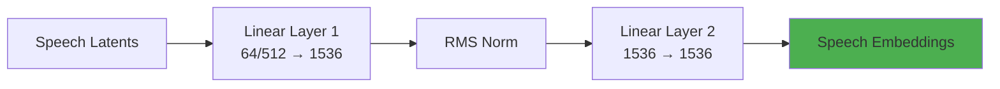
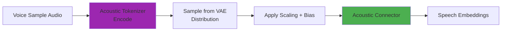
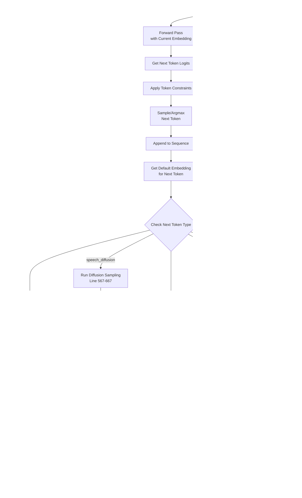

# VibeVoice Inference Architecture Documentation

This document provides a comprehensive guide to understanding the `VibeVoiceForConditionalInference` class in `vibevoice/modular/modeling_vibevoice_inference.py`, explaining how the model generates speech from text and voice samples.

## Table of Contents

1. [Overview](#overview)
2. [Model Architecture](#model-architecture)
3. [Key Components](#key-components)
4. [Voice Generation Pipeline](#voice-generation-pipeline)
5. [Detailed Component Analysis](#detailed-component-analysis)

---

## Overview

`VibeVoiceForConditionalInference` is the main inference class for VibeVoice, a text-to-speech model that combines:
- **Autoregressive generation** for speech token prediction
- **Diffusion-based synthesis** for high-quality audio generation
- **Voice cloning** through acoustic and semantic embeddings

**Location**: `vibevoice/modular/modeling_vibevoice_inference.py:59`

**Key Features**:
- Multi-speaker voice synthesis
- Streaming audio generation support
- Classifier-Free Guidance (CFG) for quality control
- Dual tokenizer system (acoustic + semantic)

---

## Model Architecture

### High-Level Architecture


### Component Hierarchy


---

## Key Components

### 1. VibeVoiceModel
**Location**: `vibevoice/modular/modeling_vibevoice.py:104`

**Purpose**: Core model combining language modeling with speech processing

**Sub-components**:
- **Language Model (QwenModel)**: Transformer-based backbone for sequence modeling
- **Speech Tokenizers**: Convert between audio and latent representations
- **Connectors**: Bridge speech features to language model space
- **Diffusion Head**: Generate high-quality speech latents

**Input/Output**:
- **Input**: Text embeddings + speech embeddings
- **Output**: Hidden states for text and speech generation

### 2. Language Model (QwenModel)
**Location**: `vibevoice/modular/modular_vibevoice_qwen.py:414`

**Purpose**: Transformer backbone for autoregressive token generation

**Architecture**:
- 28 decoder layers (for 1.5B model)
- Hidden size: 1536
- Attention heads: 12
- KV heads: 2 (GQA)
- RoPE position encoding

**Input/Output**:
- **Input**: Embeddings (batch_size, seq_len, hidden_size)
- **Output**: Hidden states (batch_size, seq_len, hidden_size)

### 3. Acoustic Tokenizer (VAE)
**Location**: `vibevoice/modular/modular_vibevoice_tokenizer.py:987`

**Purpose**: Bidirectional conversion between audio waveforms and acoustic latents

**Architecture**:


**Input/Output**:
- **Encode**: Audio (batch, 1, time) → Latents (batch, time/320, 64)
- **Decode**: Latents (batch, time/320, 64) → Audio (batch, 1, time)
- **Compression Ratio**: 320x (hop_length = 8×5×4×2)

### 4. Semantic Tokenizer (Encoder Only)
**Location**: `vibevoice/modular/modular_vibevoice_tokenizer.py:1104`

**Purpose**: Extract semantic features from audio for better speech understanding

**Architecture**: Similar to acoustic encoder but without decoder

**Input/Output**:
- **Input**: Audio (batch, 1, time)
- **Output**: Semantic latents (batch, time/320, 512)

### 5. Speech Connectors
**Location**: `vibevoice/modular/modeling_vibevoice.py:53`

**Purpose**: Project speech latents into language model embedding space

**Architecture**:


**Input/Output**:
- **Acoustic Connector**: (batch, time, 64) → (batch, time, 1536)
- **Semantic Connector**: (batch, time, 512) → (batch, time, 1536)

### 6. Diffusion Head
**Location**: `vibevoice/modular/modular_vibevoice_diffusion_head.py:180`

**Purpose**: Denoise speech latents using a diffusion process

**Architecture**:


**Layers**: 4 HeadLayers with AdaLN modulation

**Input/Output**:
- **Input**: Noisy latent (batch, 64) + Condition (batch, 1536) + Timestep
- **Output**: Predicted noise/velocity (batch, 64)

### 7. LM Head
**Location**: `modeling_vibevoice_inference.py:71`

**Purpose**: Project language model hidden states to vocabulary logits

**Input/Output**:
- **Input**: Hidden states (batch, seq_len, 1536)
- **Output**: Logits (batch, seq_len, vocab_size)

---

## Voice Generation Pipeline

### Overall Generation Flow


### Detailed Generation Steps

#### Step 1: Input Processing
**Location**: `modeling_vibevoice_inference.py:323-371`


**Inputs**:
- `input_ids`: Text tokens with special markers
- `speech_tensors`: Voice sample waveforms
- `speech_masks`: Valid frames indicator
- `speech_input_mask`: Where to insert speech embeddings

#### Step 2: Speech Input Processing
**Location**: `modeling_vibevoice_inference.py:150-178`



**Process**:
1. **Encode**: Audio → Acoustic latents via VAE encoder
2. **Sample**: Add noise based on distribution type (fix/gaussian)
3. **Normalize**: Apply scaling factor and bias for stability
4. **Connect**: Project to language model embedding space

**Code Reference**:
```python
# vibevoice/modular/modeling_vibevoice_inference.py:154-164
encoder_output = self.acoustic_tokenizer.encode(speech_tensors.unsqueeze(1))
acoustic_latents = encoder_output.sample(dist_type=self.acoustic_tokenizer.std_dist_type)[0]
acoustic_features = (acoustic_latents + self.speech_bias_factor) * self.speech_scaling_factor
acoustic_connected = self.acoustic_connector(acoustic_features)[speech_masks.cpu()]
```

#### Step 3: Prefill Phase
**Location**: `modeling_vibevoice_inference.py:461-476`


**Purpose**: Process the entire input sequence at once to initialize KV cache

**Key Operations**:
- Insert speech embeddings into text embedding sequence
- Run full forward pass through language model
- Initialize KV cache for efficient autoregressive generation

#### Step 4: Autoregressive Loop
**Location**: `modeling_vibevoice_inference.py:426-670`



**Main Loop Operations (Code Flow)**:
1. **Forward pass** (line 474): Process current embedding through model
2. **Logits processing** (line 482-484): Apply token constraints and logits processors
3. **Token selection** (line 486-492): Sample or argmax from logits
4. **Append token** (line 495): Add to sequence
5. **Get default embedding** (line 563): Lookup embedding for ALL tokens
6. **Token-specific processing** (line 513-667): Handle special tokens
   - `speech_start` (542-560): Refresh negative cache if enabled
   - `speech_end` (535-540): Clear tokenizer caches
   - `speech_diffusion` (567-667): Run diffusion, override embedding
   - `EOS` (513-522): Mark sample as finished
   - Other tokens: Use default embedding as-is
7. **Cache updates**: KV cache updated automatically during forward pass

#### Step 5: Diffusion Sampling (Core Speech Generation)
**Location**: `modeling_vibevoice_inference.py:567-667` and `modeling_vibevoice_inference.py:692-704`


**Classifier-Free Guidance (CFG)**:
```python
# modeling_vibevoice_inference.py:697-702
combined = torch.cat([half, half], dim=0)
eps = self.prediction_head(combined, t, condition)
cond_eps, uncond_eps = torch.split(eps, len(eps) // 2, dim=0)
half_eps = uncond_eps + cfg_scale * (cond_eps - uncond_eps)
```

**CFG Scale**: Controls generation quality vs diversity (default: 3.0)
- Higher scale → More conditioned on text, less diverse
- Lower scale → More diverse, less faithful to text

**Diffusion Process Details**:
1. **Initialize**: Start with random noise (64-dim latent)
2. **Iterative Denoising**: Run for N steps (default: 25)
3. **Condition**: Use language model hidden state
4. **CFG**: Combine conditional and unconditional predictions
5. **Schedule**: DPM-Solver for efficient denoising
6. **Output**: Clean speech latent

#### Step 6: Audio Streaming (Optional)
**Location**: `modeling_vibevoice_inference.py:647-650`


**Streaming Features**:
- Real-time audio generation as tokens are produced
- Convolutional streaming cache for causality
- Chunk-by-chunk processing for low latency

#### Step 7: Result Assembly
**Location**: `modeling_vibevoice_inference.py:674-689`


**Output Structure**:
- `sequences`: Generated token sequences (batch, seq_len)
- `speech_outputs`: List of audio tensors (batch, 1, time)
- `reach_max_step_sample`: Boolean flags for truncated samples

---

## Detailed Component Analysis

### Key Insight: Unified Embedding Pipeline

**Important**: ALL tokens (text, control, and speech tokens) go through the same embedding lookup at line 563:

```python
# Line 563: modeling_vibevoice_inference.py
next_inputs_embeds = self.model.get_input_embeddings()(next_tokens).unsqueeze(1)
```

**However**, for `speech_diffusion` tokens, this default embedding is **replaced** with the combined acoustic+semantic features from the diffusion process:

```python
# Line 661-666: Override embedding for speech_diffusion tokens
acoustic_embed = self.model.acoustic_connector(speech_latent)
semantic_embed = self.model.semantic_connector(semantic_features)
diffusion_embeds = acoustic_embed + semantic_embed
next_inputs_embeds[diffusion_indices] = diffusion_embeds  # Override!
```

**Token Processing Summary**:
- **Text tokens**: Use default embedding from lookup table → Feed to next iteration
- **`<speech_start>`**: Use default embedding + Refresh negative cache (line 542-560)
- **`<speech_end>`**: Use default embedding + Clear tokenizer caches (line 535-540)
- **`<speech_diffusion>`**: Use default embedding initially, then **override** with diffusion-generated features
- **`<EOS>`**: Use default embedding + Mark sample as finished

This design allows the model to:
1. Learn meaningful embeddings for special tokens during training
2. Override speech token embeddings with actual acoustic content during generation
3. Use a unified architecture for both text and speech processing

---

### Token Types and Special Tokens

**Special Tokens**:
- `<speech_start>`: Marks beginning of speech segment
- `<speech_diffusion>`: Each represents ~10ms of audio (320 samples at 24kHz)
- `<speech_end>`: Marks end of speech segment
- `<|endoftext|>`: EOS token for entire generation

**Generation Pattern**:
```
[Text tokens] <speech_start> <speech_diffusion> × N <speech_end> [More text] ...
```

### Caching Mechanisms

#### 1. KV Cache (Attention)
**Purpose**: Store attention keys/values for efficient autoregressive generation

**Type**: DynamicCache from transformers

**Management**: Updated every generation step

#### 2. Acoustic Streaming Cache
**Purpose**: Store convolutional states for streaming audio decoding

**Type**: VibeVoiceTokenizerStreamingCache

**Cleared**: At `<speech_end>` tokens

#### 3. Semantic Streaming Cache
**Purpose**: Store convolutional states for semantic encoding

**Type**: VibeVoiceTokenizerStreamingCache

**Cleared**: At `<speech_end>` tokens

### Negative Prompting for CFG

**Purpose**: Enable classifier-free guidance by maintaining separate KV cache

**Two Modes**:

1. **Refresh Negative** (default: True)
   ```mermaid
   flowchart LR
       A[speech_start] --> B[Reset Negative Cache<br/>to Initial State]
       B --> C[Track at Each Token]
   ```

2. **Non-Refresh Negative**
   ```mermaid
   flowchart LR
       A[Every Token] --> B[Forward Negative Path]
       B --> C[Correct Non-Diffusion<br/>Samples]
   ```

**Code Reference**: `modeling_vibevoice_inference.py:543-618`

### Speech Feature Scaling

**Purpose**: Normalize speech latents for stable training and inference

**Formula**:
```python
normalized_latent = (latent + bias_factor) * scaling_factor
```

**Computation** (`modeling_vibevoice.py:299-316`):
1. Calculate mean and std from training data
2. Compute scaling factor: `1.0 / std`
3. Compute bias factor: `-mean`
4. Apply in distributed training if needed

**Inverse Operation** (before decoding):
```python
latent = normalized_latent / scaling_factor - bias_factor
```

### Token Constraint

**Purpose**: Ensure only valid tokens are generated during speech synthesis

**Implementation**: `modeling_vibevoice_inference.py:44-57`

**Valid Tokens**:
- `speech_start_id`
- `speech_diffusion_id`
- `speech_end_id`
- `eos_token_id`
- `bos_token_id` (optional)

**Mechanism**: Set all other token logits to -inf before sampling

### Generation Configuration

**Key Parameters**:
- `max_new_tokens`: Maximum tokens to generate
- `max_length_times`: Multiplier for max generation length (default: 2)
- `ddpm_inference_steps`: Number of diffusion steps (default: 25)
- `cfg_scale`: Classifier-free guidance scale (default: 3.0)
- `do_sample`: Use sampling vs argmax (default: False)

**Stopping Criteria**:
1. EOS token generated
2. Max generation length reached
3. External stop signal (via `stop_check_fn`)
4. Audio streamer stopped

---

## Advanced Features

### 1. Streaming Generation

**Audio Streamer Interface**:
```python
class AudioStreamer:
    def put(self, audio_chunk, sample_indices): ...
    def end(self, sample_indices=None): ...
```

**Use Case**: Real-time TTS applications

### 2. Batch Processing

**Support**: Full batch processing with per-sample tracking

**Features**:
- Individual sample completion tracking
- Per-sample max length limits
- Batch-aware cache management

### 3. Diagnostic Features

**Verbose Mode**:
- Step-by-step progress logging
- Token type identification
- Sample completion notifications

**Progress Bar**:
- Active sample count
- Generation step tracking

---

## Performance Considerations

### Computational Bottlenecks

1. **Diffusion Sampling**: Most expensive operation
   - 25 diffusion steps per `<speech_diffusion>` token
   - Each step: forward through diffusion head + CFG

2. **Acoustic Decoding**: Second most expensive
   - Convolutional decoder with upsampling
   - Streaming cache helps but still significant

3. **Language Model Forward**: Moderate cost
   - Cached attention reduces cost after prefill
   - Incremental generation is efficient

### Optimization Strategies

1. **Reduce Diffusion Steps**: 10-15 steps often sufficient
2. **Lower CFG Scale**: Faster generation, slightly lower quality
3. **Disable Streaming**: Skip semantic encoding if not needed
4. **Batch Processing**: Leverage parallelism across samples

---

## Summary

The `VibeVoiceForConditionalInference` model implements a sophisticated pipeline for neural text-to-speech:

1. **Input**: Text scripts and voice samples
2. **Processing**: Combined language modeling and speech synthesis
3. **Generation**: Autoregressive token prediction with diffusion-based audio generation
4. **Output**: High-quality, multi-speaker speech

**Key Innovation**: Dual tokenizer approach (acoustic VAE + semantic encoder) combined with diffusion modeling enables high-quality voice cloning while maintaining efficient streaming generation.

**Model Files**:
- Main inference: `vibevoice/modular/modeling_vibevoice_inference.py`
- Core model: `vibevoice/modular/modeling_vibevoice.py`
- Language backbone: `vibevoice/modular/modular_vibevoice_qwen.py`
- Speech tokenizers: `vibevoice/modular/modular_vibevoice_tokenizer.py`
- Diffusion head: `vibevoice/modular/modular_vibevoice_diffusion_head.py`
