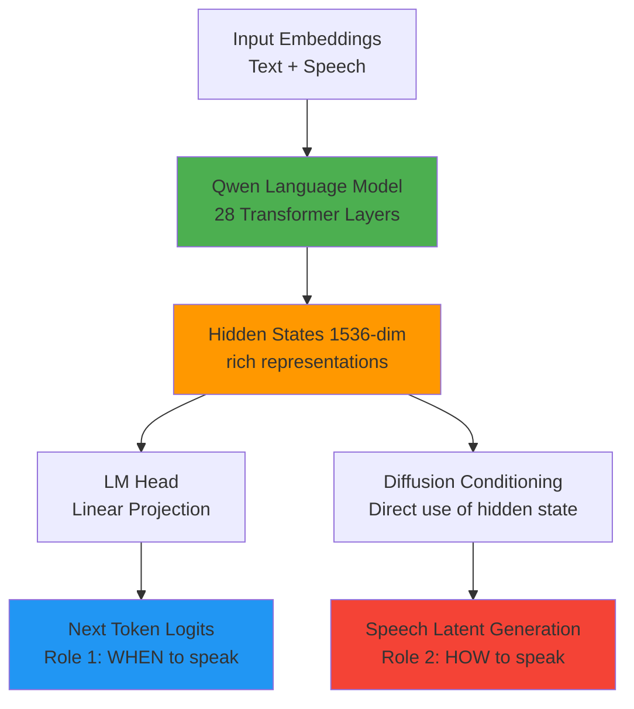
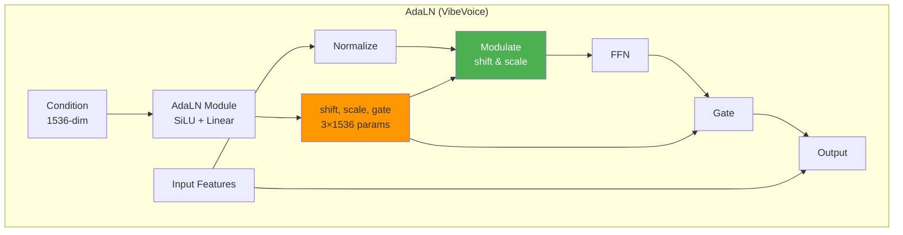
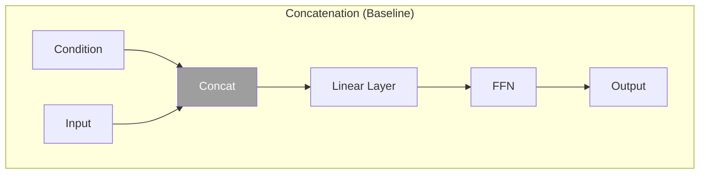
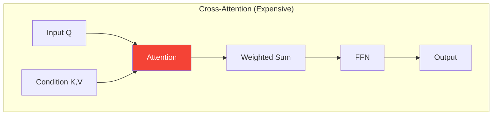
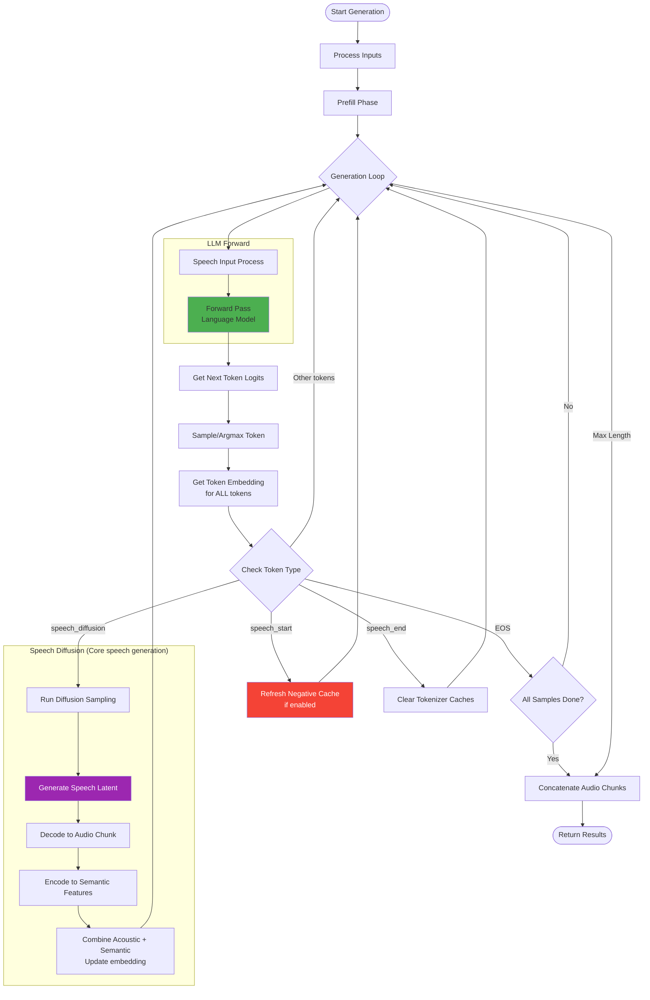
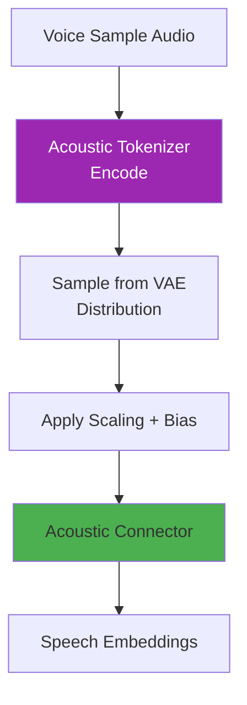
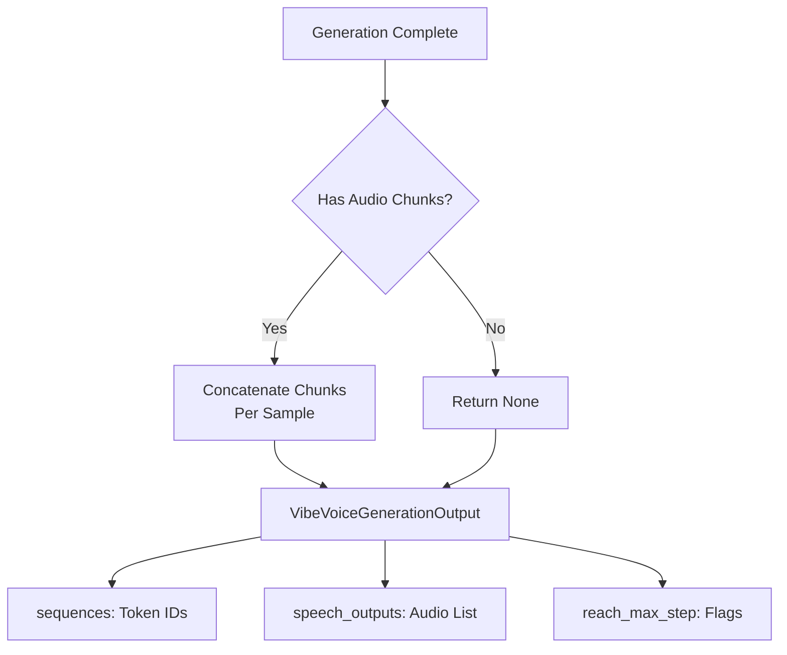

# VibeVoice Inference Architecture Documentation

This document provides a comprehensive guide to understanding the `VibeVoiceForConditionalInference` class in `vibevoice/modular/modeling_vibevoice_inference.py`, explaining how the model generates speech from text and voice samples.

## Table of Contents

1. [Overview](#overview)
2. [Model Architecture](#model-architecture)
3. [Key Components](#key-components)
4. [Voice Generation Pipeline](#voice-generation-pipeline)
5. [Detailed Component Analysis](#detailed-component-analysis)

---

## Overview

`VibeVoiceForConditionalInference` is the main inference class for VibeVoice, a text-to-speech model that combines:
- **Autoregressive generation** for speech token prediction
- **Diffusion-based synthesis** for high-quality audio generation
- **Voice cloning** through acoustic and semantic embeddings

**Location**: `vibevoice/modular/modeling_vibevoice_inference.py:59`

**Key Features**:
- Multi-speaker voice synthesis
- Streaming audio generation support
- Classifier-Free Guidance (CFG) for quality control
- Dual tokenizer system (acoustic + semantic)

---

## Model Architecture

### High-Level Architecture


### Component Hierarchy


---

## Key Components

### 1. VibeVoiceModel
**Location**: `vibevoice/modular/modeling_vibevoice.py:104`

**Purpose**: Core model combining language modeling with speech processing

**Sub-components**:
- **Language Model (QwenModel)**: Transformer-based backbone for sequence modeling
- **Speech Tokenizers**: Convert between audio and latent representations
- **Connectors**: Bridge speech features to language model space
- **Diffusion Head**: Generate high-quality speech latents

**Input/Output**:
- **Input**: Text embeddings + speech embeddings
- **Output**: Hidden states for text and speech generation

### 2. Language Model (QwenModel)
**Location**: `vibevoice/modular/modular_vibevoice_qwen.py:414`

**Purpose**: Dual-role transformer backbone serving TWO critical functions

**Architecture**:
- 28 decoder layers (for 1.5B model)
- Hidden size: 1536
- Attention heads: 12
- KV heads: 2 (GQA)
- RoPE position encoding

**Critical Dual Role**:

#### Role 1: Token Prediction (Obvious)
- Projects hidden states through LM head → next token logits
- Predicts which token comes next (text, `<speech_start>`, `<speech_diffusion>`, etc.)

#### Role 2: Speech Conditioning (Critical!)
- **Hidden states** serve as **rich contextual embeddings** for diffusion sampling
- Line 620: `positive_condition = outputs.last_hidden_state[diffusion_indices, -1, :]`
- These hidden states encode:
  - **Text semantics**: What content should be spoken
  - **Dialogue context**: Speaker identity, conversation flow
  - **Prosody hints**: Emotional tone, emphasis patterns
  - **Long-range dependencies**: Context from earlier in the conversation

**Why a Large LM Instead of MLP?**

An MLP cannot provide the sophisticated conditioning needed because:

1. **Context Understanding**: LM processes entire conversation history through self-attention
   - Example: "She said 'hello' enthusiastically" → LM encodes both the text AND the emotional cue
   - MLP would only see isolated embeddings, missing long-range context

2. **Semantic Richness**: 1.5B parameter LM creates nuanced representations
   - Understands linguistic structure, emotion, speaker characteristics
   - These nuances directly control speech quality via diffusion conditioning

3. **Multi-speaker Coherence**: Attention mechanism tracks speaker changes
   - Maintains consistent voice characteristics per speaker across turns
   - Handles complex multi-turn dialogues with speaker switching

4. **Unified Representation**: Same hidden states serve both tasks
   - Predicts WHEN to generate speech (next token prediction)
   - Controls HOW to generate speech (diffusion conditioning)
   - No need for separate context encoder

**Code Evidence**:
```python
# Line 620: LM hidden state conditions the diffusion process
positive_condition = outputs.last_hidden_state[diffusion_indices, -1, :]

# Line 623-627: This condition controls speech generation
speech_latent = self.sample_speech_tokens(
    positive_condition,  # Rich contextual embedding from LM!
    negative_condition,
    cfg_scale=cfg_scale,
)
```

**Visual Representation**:



**Concrete Example**:

Consider generating speech for: *"Alice said 'I'm so excited!' with enthusiasm"*

**Step-by-step**:
1. Language Model processes full context with self-attention
2. At position of `<speech_diffusion>` token:
   - **Hidden state** encodes: text="I'm so excited", speaker=Alice, emotion=enthusiasm, prosody=exclamatory
   - **LM head** predicts: next_token = `<speech_diffusion>` (Role 1: WHEN)
   - **Diffusion head** receives hidden state as condition (Role 2: HOW)
   - Diffusion generates speech latent matching: excited tone + Alice's voice + emphatic prosody

**Without large LM** (using MLP):
- MLP would only see current token embedding, no conversation context
- Cannot understand "enthusiasm" refers to speech emotion
- Cannot track that "Alice" is the speaker
- Cannot apply prosody from "exclamatory" punctuation
- Result: Flat, context-free speech generation ❌

**With large LM** (current design):
- Attention captures long-range context across full conversation
- Hidden states encode rich semantic + emotional + speaker information
- Diffusion receives comprehensive conditioning signal
- Result: Natural, expressive, context-aware speech ✅

**Input/Output**:
- **Input**: Embeddings (batch_size, seq_len, hidden_size)
- **Output**:
  - Hidden states (batch_size, seq_len, hidden_size) → **Diffusion conditioning**
  - Logits via LM head → Token prediction

### 3. Acoustic Tokenizer (VAE)
**Location**: `vibevoice/modular/modular_vibevoice_tokenizer.py:987`

**Purpose**: Bidirectional conversion between audio waveforms and acoustic latents

**Architecture**:


**Input/Output**:
- **Encode**: Audio (batch, 1, time) → Latents (batch, time/3200, 64)
- **Decode**: Latents (batch, time/3200, 64) → Audio (batch, 1, time)
- **Compression Ratio**: 3200x (hop_length = 8×5×5×4×2×2 = 3200)

### 4. Semantic Tokenizer (Encoder Only)
**Location**: `vibevoice/modular/modular_vibevoice_tokenizer.py:1104`

**Purpose**: Extract semantic features from audio for better speech understanding

**Architecture**: Similar to acoustic encoder but without decoder

**Input/Output**:
- **Input**: Audio (batch, 1, time)
- **Output**: Semantic latents (batch, time/320, 512)

### 5. Speech Connectors
**Location**: `vibevoice/modular/modeling_vibevoice.py:53`

**Purpose**: Project speech latents into language model embedding space

**Architecture**:


**Input/Output**:
- **Acoustic Connector**: (batch, time, 64) → (batch, time, 1536)
- **Semantic Connector**: (batch, time, 512) → (batch, time, 1536)

### 6. Diffusion Head
**Location**: `vibevoice/modular/modular_vibevoice_diffusion_head.py:180`

**Purpose**: Denoise speech latents using a diffusion process

**Architecture**:


**Layers**: 4 HeadLayers with AdaLN modulation

**Input/Output**:
- **Input**: Noisy latent (batch, 64) + Condition (batch, 1536) + Timestep
- **Output**: Predicted noise/velocity (batch, 64)

---

### Why Not UNet? Transformer-Based vs UNet Diffusion Architecture

#### Traditional UNet-Based Diffusion (e.g., Stable Diffusion, DDPM)

**Architecture**:
- **Encoder-Decoder structure** with skip connections
- **Convolutional layers** for spatial processing
- **Downsampling → Bottleneck → Upsampling** path
- **Spatial inductive bias**: Assumes 2D/3D structure (images, spectrograms)

**Typical Use Cases**:
- Image generation (Stable Diffusion)
- Spectrogram-based audio synthesis
- Data with strong spatial correlations

#### VibeVoice's Transformer-Based Diffusion Head

**Architecture**:
- **Feedforward layers** with adaptive layer normalization (AdaLN)
- **No convolutional structure** - pure MLP-based
- **Flat latent representation** (64-dim vectors, not spatial)
- **Condition modulation**: Timestep + context condition via AdaLN
- **Lightweight**: Only 4 layers with SwiGLU FFN

**Key Design Choices**:

1. **Flat Latent Space (64-dim vectors)**:
   - Speech latents are **compressed temporal features**, not spatial spectrograms
   - Each `<speech_diffusion>` token represents ~133ms of audio (3200 samples at 24kHz)
   - No 2D structure to exploit → UNet's spatial convolutions unnecessary

2. **AdaLN Modulation** (`modular_vibevoice_diffusion_head.py:143-152`):
   ```python
   # Condition (LM hidden state + timestep) modulates each layer
   shift_ffn, scale_ffn, gate_ffn = self.adaLN_modulation(c).chunk(3, dim=-1)
   x = x + gate_ffn * self.ffn(modulate(self.norm(x), shift_ffn, scale_ffn))
   ```
   - **Shift & scale**: Adjust feature statistics per sample
   - **Gate**: Control contribution of each layer
   - **Flexible conditioning**: Rich context from 1.5B LM hidden states

   **See detailed explanation**: [What is AdaLN Modulation?](#what-is-adaln-modulation-and-why-is-it-effective)

3. **Efficiency for Speech**:
   - Speech latents are **low-dimensional** (64 dims) vs images (e.g., 512×512×3)
   - Simple FFN sufficient for this scale
   - UNet adds complexity without benefit for 1D temporal data

#### Pros and Cons Comparison

| Aspect | **VibeVoice (Transformer FFN)** | **Traditional UNet** |
|--------|----------------------------------|----------------------|
| **Architecture Complexity** | ✅ Simple: 4 FFN layers with AdaLN | ❌ Complex: Encoder-decoder with skip connections |
| **Parameter Efficiency** | ✅ Lightweight: ~10M params (4 layers × 1536 hidden × 3.0 FFN ratio) | ❌ Heavy: 50-100M+ params typical |
| **Spatial Processing** | ❌ No spatial inductive bias | ✅ Strong for 2D/3D data (images, spectrograms) |
| **Temporal Speech Data** | ✅ Direct processing of flat 64-dim latents | ⚠️ Requires reshaping or treating as "image" |
| **Conditioning Flexibility** | ✅ AdaLN allows rich per-sample modulation from LM | ⚠️ Usually cross-attention or concatenation |
| **Training Stability** | ✅ Zero-init final layers (`modular_vibevoice_diffusion_head.py:241-242`) | ⚠️ Requires careful initialization |
| **Inference Speed** | ✅ Fast: 4 layers × 25 steps = 100 forward passes | ❌ Slow: Deep encoder-decoder × steps |
| **Memory Usage** | ✅ Low: Small model + flat latents | ❌ High: Large model + spatial feature maps |
| **Generalization** | ⚠️ Needs good conditioning from LM | ✅ Strong inductive bias for spatial data |

#### Why This Design Works for VibeVoice

**1. Speech is Temporal, Not Spatial**:
- Unlike images (2D) or spectrograms (time-frequency 2D), speech latents are **compressed temporal features**
- No spatial locality to exploit → UNet's convolutions add unnecessary computation
- Direct FFN processing is sufficient

**2. Rich Conditioning from Language Model**:
- The 1.5B parameter Qwen LM provides **rich contextual embeddings** (1536-dim)
- Hidden states encode: text semantics, speaker identity, emotion, prosody, long-range context
- AdaLN modulation leverages this conditioning at every layer
- **This is the real "intelligence"** - diffusion head just refines the latent guided by LM

**3. Lightweight Design Enables Real-Time**:
- Only 4 layers × 25 diffusion steps = 100 forward passes per speech token
- Much faster than UNet's deep encoder-decoder
- Critical for streaming TTS applications

**4. Proven in Related Work**:
- Similar designs in DiT (Diffusion Transformer) for images
- MaskGIT and related models use transformer-based diffusion
- Trend: "Attention is all you need" extending to diffusion models

#### Code Evidence

**Zero-Init for Stability** (`modular_vibevoice_diffusion_head.py:230-242`):
```python
def initialize_weights(self):
    # Zero-out adaLN modulation layers → stable training
    for layer in self.layers:
        nn.init.constant_(layer.adaLN_modulation[-1].weight, 0)

    # Zero-out output layers → identity at initialization
    nn.init.constant_(self.final_layer.adaLN_modulation[-1].weight, 0)
    nn.init.constant_(self.final_layer.linear.weight, 0)
```

**Modulation Mechanism** (`modular_vibevoice_diffusion_head.py:149-151`):
```python
# Each layer modulated by condition (LM hidden state + timestep)
shift_ffn, scale_ffn, gate_ffn = self.adaLN_modulation(c).chunk(3, dim=-1)
x = x + gate_ffn * self.ffn(modulate(self.norm(x), shift_ffn, scale_ffn))
```

#### Conclusion

VibeVoice uses a **transformer-based diffusion head instead of UNet** because:

1. **Speech latents are flat temporal vectors** (64-dim), not spatial data → No need for convolutions
2. **Rich conditioning from LM** (1536-dim hidden states) → AdaLN modulation is efficient
3. **Lightweight and fast** (4 layers) → Enables real-time streaming
4. **Simpler architecture** → Fewer parameters, easier to train and deploy

**Trade-off**: Relies heavily on **quality of LM conditioning**. If the language model's hidden states don't capture sufficient context, the diffusion head cannot compensate (unlike UNet's strong inductive bias). This is acceptable because VibeVoice uses a large 1.5B LM specifically for this purpose.

---

### What is AdaLN Modulation and Why Is It Effective?

**AdaLN** (Adaptive Layer Normalization) is a conditioning mechanism that allows external information (like text semantics, speaker identity, timestep) to **dynamically control** the behavior of neural network layers. In VibeVoice, it's the key mechanism that injects rich contextual information from the language model into the diffusion process.

#### The Problem AdaLN Solves

Traditional conditioning methods have limitations:

1. **Concatenation**: Simply concatenating condition vector with input
   - ❌ Condition is treated like "just another feature"
   - ❌ Network must learn to extract conditioning signal through many layers
   - ❌ Weak influence on network behavior

2. **Cross-Attention**: Query from latent, Key/Value from condition
   - ✅ Strong conditioning mechanism
   - ❌ Computationally expensive (attention over condition dimension)
   - ❌ Requires condition to be sequential (not always the case)

3. **Additive Conditioning**: `output = network(x) + condition_projection(c)`
   - ✅ Simple and cheap
   - ❌ Limited expressiveness - just adds bias
   - ❌ Cannot control network behavior dynamically

**AdaLN's Solution**: Directly modulate the **internal statistics** of each layer based on condition.

#### How AdaLN Works in VibeVoice

**Step-by-Step Mechanism** (`modular_vibevoice_diffusion_head.py:143-152`):

```python
# 1. Generate modulation parameters from condition
self.adaLN_modulation = nn.Sequential(
    nn.SiLU(),                                      # Non-linearity
    nn.Linear(cond_dim, 3 * embed_dim, bias=False) # Project to 3x parameters
)

# 2. In forward pass
shift_ffn, scale_ffn, gate_ffn = self.adaLN_modulation(c).chunk(3, dim=-1)
# Split into 3 parts: shift (1536), scale (1536), gate (1536)

# 3. Apply modulation
normalized = self.norm(x)                          # Normalize features
modulated = modulate(normalized, shift_ffn, scale_ffn)  # Shift & scale
output = self.ffn(modulated)                       # Process through FFN
x = x + gate_ffn * output                          # Gated residual connection
```

**The Modulation Function** (`modular_vibevoice_diffusion_head.py:35-37`):
```python
def modulate(x, shift, scale):
    return x * (1 + scale) + shift
```

#### The Three Components of AdaLN

**1. Scale (Multiplicative Modulation)**:
```
modulated = x * (1 + scale)
```
- **Purpose**: Controls the **magnitude** of each feature dimension
- **Effect**: Amplifies or suppresses specific features based on condition
- **Example**: For excited speech → amplify high-energy features; for calm speech → suppress them

**2. Shift (Additive Modulation)**:
```
modulated = ... + shift
```
- **Purpose**: Adjusts the **mean/bias** of each feature dimension
- **Effect**: Changes the "baseline" activation level
- **Example**: Shift prosody features up for emphasis, down for flat delivery

**3. Gate (Contribution Control)**:
```
x = x + gate * ffn_output
```
- **Purpose**: Controls how much the layer **contributes** to the output
- **Effect**: Dynamically enable/disable layer contributions
- **Example**: For simple phonemes → gate=small (skip complex processing); for complex sounds → gate=large

#### Why AdaLN is Exceptionally Effective for Conditioning

**1. Direct Statistical Control**:
- AdaLN **directly manipulates feature statistics** (mean via shift, variance via scale)
- This is mathematically equivalent to changing the "filter characteristics" of the layer
- Much more powerful than just adding bias or concatenating features

**2. Per-Sample Adaptation**:
- Each sample gets **unique** shift/scale/gate parameters based on its condition
- Same network architecture, but behavior adapts per-sample
- Example: Same FFN processes both male/female voices differently due to different modulation

**3. Rich Conditioning from Language Model**:
```python
# Line 264: Combine LM hidden state + timestep embedding
c = condition + t  # condition (1536-dim) from LM, t from timestep embedder
```
- Condition vector is 1536-dim (same as LM hidden size)
- Projects to 3×1536 = 4608 parameters per layer (shift, scale, gate)
- **Each layer has 4608 "knobs"** tuned by the condition!

**4. Gradient Flow**:
- Gradients flow **directly** from output through modulation to condition
- No need to propagate through many layers (as in concatenation)
- Efficient learning of condition-to-output mapping

**5. Computational Efficiency**:
- Only 1 linear layer per AdaLN module: `Linear(1536, 3×1536)`
- Much cheaper than cross-attention: O(d²) vs O(d×n) where n is sequence length
- No attention computation needed

#### Visual Comparison: AdaLN vs Alternatives







#### Mathematical Intuition

**Standard Layer Normalization**:
```
output = FFN(LayerNorm(x))
       = FFN((x - μ) / σ)
```
- Fixed normalization: Same μ, σ for all samples

**AdaLN**:
```
output = FFN((x - μ) / σ * (1 + scale(c)) + shift(c))
       = FFN((x - μ_effective(c)) / σ_effective(c))
```
- **Condition-dependent normalization**: μ and σ change per sample based on condition `c`
- Equivalent to having **infinite different networks**, one per condition

#### Code Flow in VibeVoice

```python
# modeling_vibevoice_inference.py:620
positive_condition = outputs.last_hidden_state[diffusion_indices, -1, :]
# Extract LM hidden state (1536-dim) at speech_diffusion token positions

# modeling_vibevoice_inference.py:623-627
speech_latent = self.sample_speech_tokens(
    positive_condition,  # This becomes the 'c' in AdaLN!
    negative_condition,
    cfg_scale=cfg_scale,
)

# Inside diffusion sampling (modeling_vibevoice_inference.py:697-702)
eps = self.prediction_head(noisy_latent, timestep, condition)
# prediction_head = VibeVoiceDiffusionHead

# modular_vibevoice_diffusion_head.py:264
c = condition + t  # Combine LM condition + timestep embedding

# modular_vibevoice_diffusion_head.py:266-267
for layer in self.layers:
    x = layer(x, c)  # Each HeadLayer uses AdaLN with condition 'c'
```

#### Why AdaLN is Perfect for Speech Generation

**1. Fine-Grained Control**: Speech requires precise control over:
   - Phoneme characteristics (vowel formants, consonant sharpness)
   - Prosody (pitch, duration, energy)
   - Speaker identity (vocal tract shape, breathiness)

   AdaLN's shift/scale/gate gives **independent control** over 1536 feature dimensions.

**2. Rich Context from LM**: The 1.5B parameter language model encodes:
   - Text semantics: "What to say"
   - Emotional tone: "How to say it"
   - Speaker identity: "Who is saying it"
   - Dialogue context: "When in conversation"

   AdaLN **directly leverages** this 1536-dim rich representation.

**3. Timestep Awareness**: Diffusion timestep `t` is added to condition:
```python
c = condition + t  # Line 264
```
   - Early steps (high noise): AdaLN guides **global structure** (pitch contour, rhythm)
   - Late steps (low noise): AdaLN refines **local details** (formant precision, breathiness)

**4. Computational Efficiency**:
   - AdaLN adds minimal computation: `1 Linear(1536, 4608)` per layer
   - 4 layers × ~7M params = ~28M params for modulation
   - Compare to cross-attention: Would need ~50M+ params for similar expressiveness

#### Comparison to UNet Conditioning

**UNet (e.g., Stable Diffusion)**:
- Uses **cross-attention** for conditioning
- Condition (text embeddings) is sequential → attend over tokens
- Expensive: O(spatial_size × text_length) attention

**VibeVoice (AdaLN)**:
- Condition is **single vector** per sample (1536-dim LM hidden state)
- No need for cross-attention over sequence
- Cheap: O(1536²) linear projection (already computed by LM!)

This is another reason why VibeVoice doesn't need UNet - **AdaLN is more efficient for flat latent conditioning**.

#### Empirical Evidence

**Zero-Init Training Trick** (`modular_vibevoice_diffusion_head.py:237-242`):
```python
# Zero-out adaLN modulation layers at initialization
for layer in self.layers:
    nn.init.constant_(layer.adaLN_modulation[-1].weight, 0)
```

At initialization:
- `shift = 0`, `scale = 0`, `gate = 0`
- `modulate(x, 0, 0) = x * (1+0) + 0 = x` (identity)
- `x + 0 * ffn(x) = x` (skip FFN)
- Network starts as **identity function**

Why this works:
- Training is **stable** - no random behavior at start
- Network gradually learns to use shift/scale/gate
- Proves AdaLN **truly controls** layer behavior (starts disabled, learns to enable)

#### Conclusion

AdaLN modulation is effective for conditioning because:

1. **Direct control**: Manipulates layer statistics (mean, variance, contribution) directly
2. **Expressive**: 4608 parameters per layer controlled by condition
3. **Efficient**: Single linear layer, no attention computation
4. **Sample-adaptive**: Same network behaves differently per sample
5. **Gradient-friendly**: Direct path from condition to output

In VibeVoice, AdaLN is the **bridge** between the language model's rich contextual understanding and the diffusion model's generation capability. The LM "decides" what speech to generate (semantics, prosody, speaker), and AdaLN translates this decision into **per-layer control signals** that guide the diffusion process.

---

### 7. LM Head
**Location**: `modeling_vibevoice_inference.py:71`

**Purpose**: Project language model hidden states to vocabulary logits

**Input/Output**:
- **Input**: Hidden states (batch, seq_len, 1536)
- **Output**: Logits (batch, seq_len, vocab_size)

---

## Voice Generation Pipeline

### Overall Generation Flow



### Detailed Generation Steps

#### Step 1: Input Processing
**Location**: `modeling_vibevoice_inference.py:323-371`


**Inputs**:
- `input_ids`: Text tokens with special markers
- `speech_tensors`: Voice sample waveforms
- `speech_masks`: Valid frames indicator
- `speech_input_mask`: Where to insert speech embeddings

#### Step 2: Speech Input Processing
**Location**: `modeling_vibevoice_inference.py:150-178`



**Process**:
1. **Encode**: Audio → Acoustic latents via VAE encoder
2. **Sample**: Add noise based on distribution type (fix/gaussian)
3. **Normalize**: Apply scaling factor and bias for stability
4. **Connect**: Project to language model embedding space

**Code Reference**:
```python
# vibevoice/modular/modeling_vibevoice_inference.py:154-164
encoder_output = self.acoustic_tokenizer.encode(speech_tensors.unsqueeze(1))
acoustic_latents = encoder_output.sample(dist_type=self.acoustic_tokenizer.std_dist_type)[0]
acoustic_features = (acoustic_latents + self.speech_bias_factor) * self.speech_scaling_factor
acoustic_connected = self.acoustic_connector(acoustic_features)[speech_masks.cpu()]
```

#### Step 3: Prefill Phase
**Location**: `modeling_vibevoice_inference.py:461-476`


**Purpose**: Process the entire input sequence at once to initialize KV cache

**Key Operations**:
- Insert speech embeddings into text embedding sequence
- Run full forward pass through language model
- Initialize KV cache for efficient autoregressive generation

#### Step 4: Autoregressive Loop
**Location**: `modeling_vibevoice_inference.py:426-670`


**Main Loop Operations (Code Flow)**:
1. **Forward pass** (line 474): Process current embedding through model
2. **Logits processing** (line 482-484): Apply token constraints and logits processors
3. **Token selection** (line 486-492): Sample or argmax from logits
4. **Append token** (line 495): Add to sequence
5. **Get default embedding** (line 563): Lookup embedding for ALL tokens
6. **Token-specific processing** (line 513-667): Handle special tokens
   - `speech_start` (542-560): Refresh negative cache if enabled
   - `speech_end` (535-540): Clear tokenizer caches
   - `speech_diffusion` (567-667): Run diffusion, override embedding
   - `EOS` (513-522): Mark sample as finished
   - Other tokens: Use default embedding as-is
7. **Cache updates**: KV cache updated automatically during forward pass

#### Step 5: Diffusion Sampling (Core Speech Generation)
**Location**: `modeling_vibevoice_inference.py:567-667` and `modeling_vibevoice_inference.py:692-704`


**Classifier-Free Guidance (CFG)**:
```python
# modeling_vibevoice_inference.py:697-702
combined = torch.cat([half, half], dim=0)
eps = self.prediction_head(combined, t, condition)
cond_eps, uncond_eps = torch.split(eps, len(eps) // 2, dim=0)
half_eps = uncond_eps + cfg_scale * (cond_eps - uncond_eps)
```

**CFG Scale**: Controls generation quality vs diversity (default: 3.0)
- Higher scale → More conditioned on text, less diverse
- Lower scale → More diverse, less faithful to text

**Diffusion Process Details**:
1. **Initialize**: Start with random noise (64-dim latent)
2. **Iterative Denoising**: Run for N steps (default: 25)
3. **Condition**: Use language model hidden state
4. **CFG**: Combine conditional and unconditional predictions
5. **Schedule**: DPM-Solver for efficient denoising
6. **Output**: Clean speech latent

#### Step 6: Audio Streaming (Optional)
**Location**: `modeling_vibevoice_inference.py:647-650`


**Streaming Features**:
- Real-time audio generation as tokens are produced
- Convolutional streaming cache for causality
- Chunk-by-chunk processing for low latency

#### Step 7: Result Assembly
**Location**: `modeling_vibevoice_inference.py:674-689`



**Output Structure**:
- `sequences`: Generated token sequences (batch, seq_len)
- `speech_outputs`: List of audio tensors (batch, 1, time)
- `reach_max_step_sample`: Boolean flags for truncated samples

---

## Detailed Component Analysis

### Key Insight: Unified Embedding Pipeline

**Important**: ALL tokens (text, control, and speech tokens) go through the same embedding lookup at line 563:

```python
# Line 563: modeling_vibevoice_inference.py
next_inputs_embeds = self.model.get_input_embeddings()(next_tokens).unsqueeze(1)
```

**However**, for `speech_diffusion` tokens, this default embedding is **replaced** with the combined acoustic+semantic features from the diffusion process:

```python
# Line 661-666: Override embedding for speech_diffusion tokens
acoustic_embed = self.model.acoustic_connector(speech_latent)
semantic_embed = self.model.semantic_connector(semantic_features)
diffusion_embeds = acoustic_embed + semantic_embed
next_inputs_embeds[diffusion_indices] = diffusion_embeds  # Override!
```

**Token Processing Summary**:
- **Text tokens**: Use default embedding from lookup table → Feed to next iteration
- **`<speech_start>`**: Use default embedding + Refresh negative cache (line 542-560)
- **`<speech_end>`**: Use default embedding + Clear tokenizer caches (line 535-540)
- **`<speech_diffusion>`**: Use default embedding initially, then **override** with diffusion-generated features
- **`<EOS>`**: Use default embedding + Mark sample as finished

This design allows the model to:
1. Learn meaningful embeddings for special tokens during training
2. Override speech token embeddings with actual acoustic content during generation
3. Use a unified architecture for both text and speech processing

---

### Token Types and Special Tokens

**Special Tokens**:
- `<speech_start>`: Marks beginning of speech segment
- `<speech_diffusion>`: Each represents ~133ms of audio (3200 samples at 24kHz)
- `<speech_end>`: Marks end of speech segment
- `<|endoftext|>`: EOS token for entire generation

#### Why ~133ms per Token? Understanding Temporal Compression

Each `<speech_diffusion>` token represents a **compressed chunk of audio**. Here's how the compression works:

**Step-by-Step Calculation**:

1. **Audio Sampling Rate**: 24,000 Hz (24 kHz)
   - 24,000 samples per second of audio

2. **Acoustic Tokenizer Compression** (from config: `qwen2.5_1.5b_64k.json:23-29`):
   - Encoder uses **6 downsampling layers** with ratios: `[8, 5, 5, 4, 2, 2]`
   - Total compression ratio: 8 × 5 × 5 × 4 × 2 × 2 = **3200x**
   - This is the `hop_length` of the encoder (`modular_vibevoice_tokenizer.py:677`)

3. **Samples per Token**:
   - Each latent frame represents 3200 audio samples
   - At 24kHz: 3200 samples ÷ 24,000 Hz = **0.1333 seconds = 133.33 ms**

**Visual Representation**:

```
Audio Waveform (24kHz):
[3200 samples] → Encoder → [1 latent vector (64-dim)] → Decoder → [3200 samples]
|←  133.33ms →|                                                    |← 133.33ms →|

Multiple tokens for longer speech:
Token 1: samples 0-3199     (0-133ms)    → latent_1
Token 2: samples 3200-6399  (133-267ms)  → latent_2
Token 3: samples 6400-9599  (267-400ms)  → latent_3
...
```

**Code Evidence**:

```python
# vibevoice/modular/modular_vibevoice_tokenizer.py:674-677
self.ratios = list(reversed(config.ratios))  # [8,5,5,4,2,2]
self.hop_length = np.prod(self.ratios)       # 3200
```

```python
# vibevoice/processor/vibevoice_processor.py:35
def __init__(self, ..., speech_tok_compress_ratio=3200, ...):
    # Compression ratio used for calculating sequence lengths
```

**Implications**:

1. **Efficient Representation**: 3200x compression drastically reduces sequence length
   - 1 second of audio (24,000 samples) → ~7.5 latent tokens
   - 10 seconds of audio → ~75 tokens

2. **Temporal Resolution**: Each token captures 133ms of audio context
   - Good balance between compression and temporal detail
   - Sufficient for capturing phonemes and prosody patterns

3. **Generation Speed**: Fewer tokens = faster generation
   - Autoregressive generation processes fewer steps
   - Each diffusion token still requires 25 diffusion steps, but total tokens reduced

**Comparison to Other Models**:
- **Codec models** (e.g., EnCodec): Often use 50-75 Hz frame rates (~13-20ms per token)
- **VibeVoice**: 7.5 Hz effective rate (~133ms per token) - much higher compression
- **Trade-off**: Higher compression → fewer tokens but requires more powerful diffusion to reconstruct quality

**Example - 1 Second of Speech**:
- Audio: 24,000 samples at 24kHz = 1 second
- Compressed: 24,000 ÷ 3200 = 7.5 tokens
- Pattern: `<speech_start> <speech_diffusion> × 7-8 <speech_end>`
- Each `<speech_diffusion>` token triggers diffusion sampling (25 steps)

**Generation Pattern**:
```
[Text tokens] <speech_start> <speech_diffusion> × N <speech_end> [More text] ...
```

### Caching Mechanisms

#### 1. KV Cache (Attention)
**Purpose**: Store attention keys/values for efficient autoregressive generation

**Type**: DynamicCache from transformers

**Management**: Updated every generation step

#### 2. Acoustic Streaming Cache
**Purpose**: Store convolutional states for streaming audio decoding

**Type**: VibeVoiceTokenizerStreamingCache

**Cleared**: At `<speech_end>` tokens

#### 3. Semantic Streaming Cache
**Purpose**: Store convolutional states for semantic encoding

**Type**: VibeVoiceTokenizerStreamingCache

**Cleared**: At `<speech_end>` tokens

### Negative Prompting for CFG

**Purpose**: Enable classifier-free guidance by maintaining separate KV cache

**Two Modes**:

1. **Refresh Negative** (default: True)
   ```mermaid
   flowchart LR
       A[speech_start] --> B[Reset Negative Cache<br/>to Initial State]
       B --> C[Track at Each Token]
   ```

2. **Non-Refresh Negative**
   ```mermaid
   flowchart LR
       A[Every Token] --> B[Forward Negative Path]
       B --> C[Correct Non-Diffusion<br/>Samples]
   ```

**Code Reference**: `modeling_vibevoice_inference.py:543-618`

### Speech Feature Scaling

**Purpose**: Normalize speech latents for stable training and inference

**Formula**:
```python
normalized_latent = (latent + bias_factor) * scaling_factor
```

**Computation** (`modeling_vibevoice.py:299-316`):
1. Calculate mean and std from training data
2. Compute scaling factor: `1.0 / std`
3. Compute bias factor: `-mean`
4. Apply in distributed training if needed

**Inverse Operation** (before decoding):
```python
latent = normalized_latent / scaling_factor - bias_factor
```

### Token Constraint

**Purpose**: Ensure only valid tokens are generated during speech synthesis

**Implementation**: `modeling_vibevoice_inference.py:44-57`

**Valid Tokens**:
- `speech_start_id`
- `speech_diffusion_id`
- `speech_end_id`
- `eos_token_id`
- `bos_token_id` (optional)

**Mechanism**: Set all other token logits to -inf before sampling

### Generation Configuration

**Key Parameters**:
- `max_new_tokens`: Maximum tokens to generate
- `max_length_times`: Multiplier for max generation length (default: 2)
- `ddpm_inference_steps`: Number of diffusion steps (default: 25)
- `cfg_scale`: Classifier-free guidance scale (default: 3.0)
- `do_sample`: Use sampling vs argmax (default: False)

**Stopping Criteria**:
1. EOS token generated
2. Max generation length reached
3. External stop signal (via `stop_check_fn`)
4. Audio streamer stopped

---

## Advanced Features

### 1. Streaming Generation

**Audio Streamer Interface**:
```python
class AudioStreamer:
    def put(self, audio_chunk, sample_indices): ...
    def end(self, sample_indices=None): ...
```

**Use Case**: Real-time TTS applications

### 2. Batch Processing

**Support**: Full batch processing with per-sample tracking

**Features**:
- Individual sample completion tracking
- Per-sample max length limits
- Batch-aware cache management

### 3. Diagnostic Features

**Verbose Mode**:
- Step-by-step progress logging
- Token type identification
- Sample completion notifications

**Progress Bar**:
- Active sample count
- Generation step tracking

---

## Performance Considerations

### Computational Bottlenecks

1. **Diffusion Sampling**: Most expensive operation
   - 25 diffusion steps per `<speech_diffusion>` token
   - Each step: forward through diffusion head + CFG

2. **Acoustic Decoding**: Second most expensive
   - Convolutional decoder with upsampling
   - Streaming cache helps but still significant

3. **Language Model Forward**: Moderate cost
   - Cached attention reduces cost after prefill
   - Incremental generation is efficient

### Optimization Strategies

1. **Reduce Diffusion Steps**: 10-15 steps often sufficient
2. **Lower CFG Scale**: Faster generation, slightly lower quality
3. **Disable Streaming**: Skip semantic encoding if not needed
4. **Batch Processing**: Leverage parallelism across samples

---

## Summary

The `VibeVoiceForConditionalInference` model implements a sophisticated pipeline for neural text-to-speech:

1. **Input**: Text scripts and voice samples
2. **Processing**: Combined language modeling and speech synthesis
3. **Generation**: Autoregressive token prediction with diffusion-based audio generation
4. **Output**: High-quality, multi-speaker speech

### Key Architectural Insights

#### 1. **Language Model Has Dual Role** (Critical!)
The large language model (1.5B Qwen) is NOT just for token prediction:
- **Role 1**: Predict WHEN to generate speech (next token)
- **Role 2**: Provide rich contextual conditioning for HOW to generate speech
- Hidden states encode: semantics, emotion, speaker identity, prosody, long-range context
- This is why a simple MLP cannot replace it - context understanding is essential

#### 2. **Unified Embedding Pipeline**
All tokens (text + speech) use the same embedding lookup initially:
- Default embeddings for text, control, and special tokens
- Only `<speech_diffusion>` tokens override embeddings with acoustic+semantic features
- Enables unified architecture while preserving speech quality

#### 3. **Dual Tokenizer System**
- **Acoustic tokenizer** (VAE): Bidirectional audio ↔ latent conversion
- **Semantic tokenizer** (Encoder): Extract meaning from generated audio
- Combined features create richer speech representations than single tokenizer

#### 4. **Diffusion for Quality**
- Language model predicts discrete tokens (sequence structure)
- Diffusion model generates continuous latents (audio quality)
- Classifier-Free Guidance ensures conditioning fidelity
- Separation of concerns: structure vs quality

#### 5. **Streaming Architecture**
- Convolutional caches enable chunk-by-chunk processing
- Real-time audio generation as tokens are produced
- Critical for interactive applications (voice assistants, real-time dubbing)

**Model Files**:
- Main inference: `vibevoice/modular/modeling_vibevoice_inference.py`
- Core model: `vibevoice/modular/modeling_vibevoice.py`
- Language backbone: `vibevoice/modular/modular_vibevoice_qwen.py`
- Speech tokenizers: `vibevoice/modular/modular_vibevoice_tokenizer.py`
- Diffusion head: `vibevoice/modular/modular_vibevoice_diffusion_head.py`

---

## Appendix: AdaLN in Modern Generative Models

This appendix provides context on Adaptive Layer Normalization (AdaLN) and its adoption across state-of-the-art generative models, demonstrating that VibeVoice is part of a cutting-edge lineage of models leveraging this powerful conditioning technique.

### Evolution of Adaptive Normalization

#### Origins: Adaptive Instance Normalization (2017)

**Paper**: "Arbitrary Style Transfer in Real-time with Adaptive Instance Normalization" - Huang & Belongie

**Key Innovation**:
- Introduced adaptive normalization for style transfer
- Unlike Batch/Instance Normalization, AdaIN has **no learnable affine parameters**
- Instead, **adaptively computes** affine parameters from style input
- Formula: `AdaIN(x, y) = σ(y) * ((x - μ(x)) / σ(x)) + μ(y)`

**Impact**:
- Enabled real-time arbitrary style transfer
- Foundation for subsequent adaptive normalization techniques
- Demonstrated power of input-dependent feature modulation

#### StyleGAN Era (2018-2021)

**StyleGAN (2018)** - Karras et al., NVIDIA

**Architecture**:
- Style-based generator using **adaptive instance normalization**
- Affine parameters (scale/shift) computed from learned style vectors
- Each layer receives different style parameters
- No fixed normalization parameters

**Key Features**:
- Disentangled latent space control
- Progressive growing for high-resolution synthesis
- Style mixing for fine-grained control

**StyleGAN2 (2019)** and **StyleGAN3 (2021)**:
- Refined AdaIN mechanisms
- Improved training stability
- Better handling of spatial information

**Legacy**:
- Proved adaptive normalization superior to fixed normalization in GANs
- Inspired diffusion models to adopt similar techniques
- Established pattern: **condition → affine parameters → modulate features**

### Modern Diffusion Models with AdaLN

#### 1. DiT (Diffusion Transformer) - 2023

**Paper**: "Scalable Diffusion Models with Transformers" - Peebles & Xie (ICCV 2023)

**Breakthrough**: First to popularize AdaLN in transformer-based diffusion models

**Architecture**:
- Replaces U-Net with transformer operating on latent patches
- Each block uses **AdaLN-Zero** for conditioning
- Conditions on timestep and class labels

**AdaLN-Zero Innovation**:
```python
# Initialize modulation weights to ZERO
nn.init.constant_(adaLN_modulation[-1].weight, 0)

# At initialization: network is identity function
# Gradually learns optimal modulation during training
```

**Conditioning Comparison** (from DiT paper):
| Method | FID ↓ | Gflops |
|--------|-------|--------|
| Cross-Attention | 19.5 | 119 |
| In-context | 20.4 | 110 |
| **AdaLN-Zero** | **18.5** | **118** |

**Key Findings**:
- AdaLN-Zero achieves **lowest FID** (best quality)
- Most **compute-efficient** conditioning method
- AdaLN parameters are **10-20% of total model**
- Scales from 450M to 7B parameters

**Impact**:
- Became foundation for modern diffusion transformers
- Proved transformers can replace U-Net in diffusion models
- Established AdaLN-Zero as standard for transformer diffusion

#### 2. Stable Diffusion 3 / 3.5 - 2024

**Paper**: "Scaling Rectified Flow Transformers for High-Resolution Image Synthesis" - Esser et al.

**Architecture**: MMDiT (Multimodal Diffusion Transformer)

**Key Innovation**:
- **Separate transformer streams** for text and image
- Each modality has independent weights
- **Joint attention** across modalities
- AdaLN-Zero for both streams

**AdaLN Implementation**:
```python
# Text stream
text_features = adaLN_modulate(text_features, condition_text + timestep)

# Image stream
image_features = adaLN_modulate(image_features, condition_img + timestep)

# Joint attention
output = cross_modal_attention(text_features, image_features)
```

**Scale**:
- Models: 450M to **8 billion parameters**
- Blocks: 15 to 38 transformer blocks
- Resolution: Up to 2048×2048 efficiently

**Performance**:
- **72% quality improvement** over SD 2.1
- Better text understanding and spelling
- Superior composition and typography

**Why AdaLN?**:
- Enables efficient multimodal conditioning
- Cheaper than cross-attention for timestep injection
- Scales to billions of parameters smoothly

#### 3. Sora (OpenAI) - 2024

**Application**: Text-to-video generation

**Architecture**: Diffusion transformer for video patches

**Technical Report**: "Video generation models as world simulators"

**AdaLN Usage**:
- Predicts clean video patches from noisy patches
- Conditions on: timesteps, text prompts, video metadata
- Uses **AdaLN-Zero with 3D RoPE** (Rotary Position Embedding)

**Implementation Details**:
```python
# Timestep → modulation parameters
scale, shift, gate = adaLN_modulation(timestep_emb + text_emb)

# Applied to 3D video patches
modulated = modulate(norm(video_patches), shift, scale)
output = video_patches + gate * transformer_block(modulated)
```

**Key Features**:
- AdaLN injected into **self-attention and FFN separately**
- Handles variable resolution, duration, aspect ratios
- Demonstrates scaling to long-form video (up to 1 minute)

**Significance**:
- Most advanced text-to-video model (as of 2024)
- Shows AdaLN scales beyond images to **temporal data**
- Proves adaptive conditioning works for complex 3D+time synthesis

#### 4. GenTron - 2024

**Paper**: "GenTron: Diffusion Transformers for Image and Video Generation" (CVPR 2024)

**Innovation**: Unified architecture for both image and video

**AdaLN Design**:
- Extends DiT's AdaLN to temporal dimension
- **Spatial AdaLN**: Conditions on frame-level features
- **Temporal AdaLN**: Conditions on video-level features
- Hierarchical conditioning strategy

**Performance**:
- Competitive with specialized image/video models
- Demonstrates AdaLN's flexibility for multi-task generation

#### 5. Open-Sora Plan - 2024

**Type**: Open-source video generation model

**Architecture**: DiT-based with video extensions

**AdaLN Implementation**:
```python
# 3D RoPE + AdaLN-Zero
timestep_emb = timestep_embedder(t)
spatial_temporal_emb = rope_3d(video_patches)

scale, shift, gate = adaLN_modulation(timestep_emb)
modulated = modulate(norm(spatial_temporal_emb), shift, scale)
```

**Features**:
- Open-source alternative to proprietary models
- Uses AdaLN-Zero for stable training
- Supports multi-resolution training

**Contribution**:
- Makes advanced AdaLN techniques accessible
- Community-driven improvements to conditioning strategies

#### 6. VAR (Visual AutoRegressive Models) - 2024

**Innovation**: Combines autoregressive modeling with AdaLN

**Architecture**:
- Next-token prediction for images
- AdaLN conditions on previously generated tokens
- Bridges autoregressive and diffusion approaches

**Significance**:
- Shows AdaLN works beyond pure diffusion models
- Adaptive conditioning for autoregressive generation

### AdaLN Variants and Extensions

#### AdaLN-Zero vs Standard AdaLN

**Standard AdaLN**:
- Random initialization of modulation parameters
- Network learns scale/shift from scratch

**AdaLN-Zero** (DiT innovation):
- **Zero initialization** of final modulation layer
- Network starts as identity: `f(x) = x`
- Gradually learns optimal modulation

**Advantages of AdaLN-Zero**:
1. **Training stability**: No random perturbations at start
2. **Better convergence**: Smooth learning curve
3. **Lower FID**: Empirically better results
4. **Easier hyperparameter tuning**: Less sensitive to learning rate

#### AdaGN (Adaptive Group Normalization)

Used in some U-Net diffusion models:
- Applies to grouped channels instead of full layer
- Cheaper computation for convolutional architectures
- Similar principle: condition → scale/shift → modulate

#### FiLM (Feature-wise Linear Modulation)

Earlier technique (2018) in visual reasoning:
```python
FiLM(x, γ, β) = γ * x + β
```
- Simpler than AdaLN (no normalization step)
- Used in VQA (Visual Question Answering) models
- Inspired AdaLN's scale/shift design

### Comparison: AdaLN Across Domains

| Model | Domain | Year | AdaLN Type | Parameters | Key Innovation |
|-------|--------|------|------------|------------|----------------|
| **StyleGAN** | Images (GAN) | 2018 | AdaIN | ~30M | Style-based generation |
| **DiT** | Images (Diffusion) | 2023 | AdaLN-Zero | 450M-7B | Transformer diffusion |
| **Stable Diffusion 3** | Images (Diffusion) | 2024 | AdaLN-Zero | 450M-8B | Multimodal MMDiT |
| **Sora** | Video (Diffusion) | 2024 | AdaLN-Zero + 3D RoPE | Unknown | Spatiotemporal patches |
| **GenTron** | Image+Video | 2024 | Hierarchical AdaLN | ~1B | Unified architecture |
| **Open-Sora Plan** | Video (Open) | 2024 | AdaLN-Zero | ~1.1B | Open-source video |
| **VibeVoice** | Speech (Diffusion) | 2024 | AdaLN-Zero | 1.5B (LM) + 10M (head) | Audio latent diffusion |

### Why AdaLN Became the Standard

#### 1. Computational Efficiency

**Cross-Attention** (traditional approach):
- Complexity: O(sequence_length × condition_length)
- For images: O(256 × text_tokens) per layer
- Memory-intensive attention matrices

**AdaLN**:
- Complexity: O(hidden_dim²)
- Single linear projection: `Linear(1536, 3×1536)`
- No attention computation needed

**Speedup**: AdaLN is **2-3x faster** than cross-attention for conditioning

#### 2. Parameter Efficiency

**Example** (VibeVoice diffusion head):
- Total parameters: ~40M
- AdaLN parameters: ~7M (4 layers × 1536 → 4608)
- Percentage: **~18% of model**

Compare to cross-attention:
- Would need ~50M+ parameters for similar expressiveness

#### 3. Training Stability

**Zero-init training** (from DiT paper):
- Loss curve is smooth from iteration 0
- No initial spike in loss
- Faster convergence to optimal solution

**Traditional methods**:
- Random initialization causes instability
- Requires careful learning rate tuning
- May diverge early in training

#### 4. Scalability

**Proven scale** (Stable Diffusion 3):
- 15 blocks (450M) → 38 blocks (8B)
- AdaLN scales **linearly** with model size
- No degradation in conditioning effectiveness

#### 5. Flexibility

**Works across modalities**:
- Images: DiT, SD3
- Video: Sora, GenTron, Open-Sora
- Speech: **VibeVoice**
- Autoregressive: VAR

**Handles diverse conditions**:
- Timesteps (all models)
- Class labels (DiT)
- Text embeddings (SD3, Sora)
- LM hidden states (**VibeVoice**)

### Technical Deep Dive: Why AdaLN Works

#### Mathematical Perspective

**Standard normalization**:
```
y = γ * (x - μ) / σ + β
```
- γ, β are **fixed learned parameters**
- Same for all inputs

**Adaptive normalization**:
```
γ(c), β(c) = MLP(condition)
y = γ(c) * (x - μ) / σ + β(c)
```
- γ, β are **functions of condition**
- Different for each input based on context

**Effect**: Equivalent to having **infinite specialized networks**, one per condition

#### Information Theory Perspective

**Cross-attention**:
- Information flow: Condition → Keys/Values → Attention weights → Output
- Indirect path with multiple transformations

**AdaLN**:
- Information flow: Condition → Scale/Shift → Feature modulation → Output
- **Direct path** from condition to feature statistics

**Advantage**: Fewer transformations = less information loss

#### Gradient Flow Perspective

**Concatenation**:
```
∂Loss/∂condition = ∂Loss/∂output × ∂output/∂layers × ∂layers/∂concat × ∂concat/∂condition
```
- Gradients pass through many layers

**AdaLN**:
```
∂Loss/∂condition = ∂Loss/∂output × ∂output/∂modulation × ∂modulation/∂condition
```
- **Shorter gradient path**
- Faster learning of condition-to-output mapping

### Future Directions

#### Emerging Trends (2024-2025)

1. **Hierarchical AdaLN**: Different modulation at different scales
2. **Attention + AdaLN**: Hybrid conditioning (best of both)
3. **Learnable Zero-init**: Adaptive initialization strategies
4. **Multi-condition AdaLN**: Separate streams for different condition types
5. **Quantized AdaLN**: Low-precision modulation for edge deployment

#### Open Research Questions

1. **Optimal number of modulation parameters**: 2 (scale/shift) vs 3 (+ gate) vs more?
2. **Initialization strategies**: Always zero-init, or condition-dependent?
3. **Modulation function**: Linear projection vs more complex MLPs?
4. **Normalization choice**: LayerNorm vs GroupNorm vs RMSNorm for AdaLN?

### Key Takeaways

1. **AdaLN has become the de facto standard** for conditioning in transformer-based generative models
2. **Proven across domains**: Images, video, audio (VibeVoice), autoregressive generation
3. **Scalable**: Works from 450M to 8B+ parameters
4. **Efficient**: 2-3x faster than cross-attention, 10-20% of parameters
5. **Stable**: Zero-init enables smooth training
6. **Flexible**: Adapts to any conditioning signal (timesteps, text, hidden states)

**VibeVoice is at the forefront** of this trend, applying state-of-the-art AdaLN-Zero conditioning to speech generation—demonstrating the technique's versatility and effectiveness beyond visual domains.

### References

**Foundational Papers**:
1. Huang & Belongie (2017). "Arbitrary Style Transfer in Real-time with Adaptive Instance Normalization". *ICCV 2017*.
2. Karras et al. (2018). "A Style-Based Generator Architecture for GANs". *CVPR 2019*.
3. Peebles & Xie (2023). "Scalable Diffusion Models with Transformers". *ICCV 2023*.
4. Esser et al. (2024). "Scaling Rectified Flow Transformers for High-Resolution Image Synthesis". *Stability AI Technical Report*.

**Contemporary Work**:
5. OpenAI (2024). "Video generation models as world simulators". *Technical Report*.
6. Chen et al. (2024). "GenTron: Diffusion Transformers for Image and Video Generation". *CVPR 2024*.
7. Open-Sora Plan (2024). "Open-Source Large Video Generation Model". *ArXiv*.

**Related Techniques**:
8. Perez et al. (2018). "FiLM: Visual Reasoning with a General Conditioning Layer". *AAAI 2018*.
9. Dhariwal & Nichol (2021). "Diffusion Models Beat GANs on Image Synthesis". *NeurIPS 2021* (AdaGN).

---
